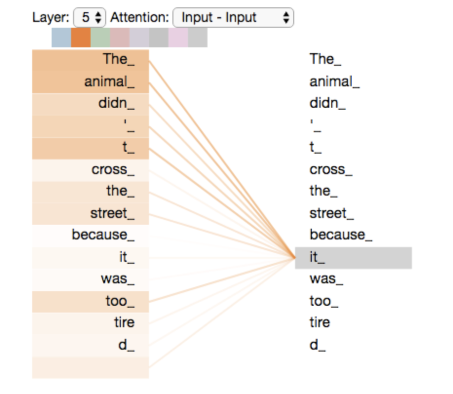
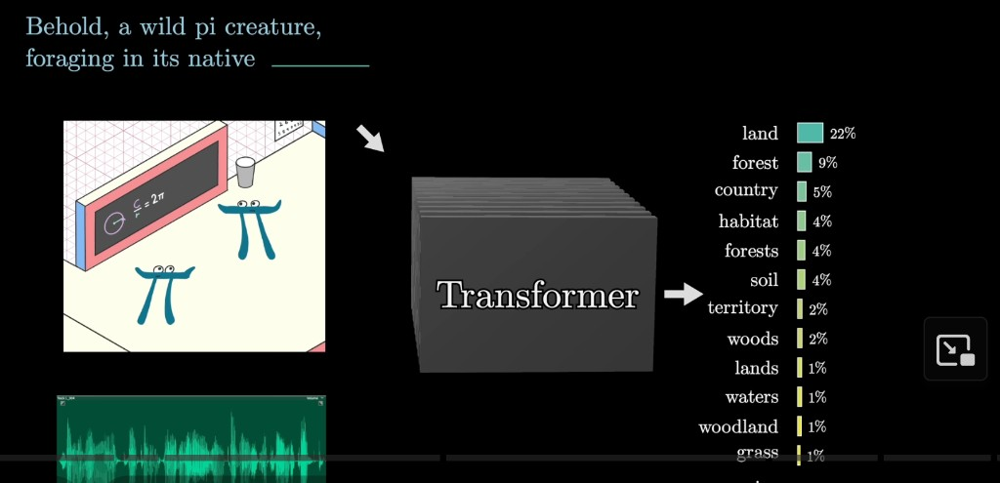

<!-- .slide: class="deck-title" -->

# LLMs: **Inside Out**

<p class="deck-subtitle">From Transformers to Agents — A 2-Hour Deep Dive</p>
<p class="deck-author">Uzziel Perez · La Salle Campus, Barcelona</p>

<p class="deck-archive-link"><a href="backup/pre-rebuild-2026-04-09/index.html" target="_blank" rel="noopener noreferrer">Previous full deck (archived)</a></p>

---

<!-- .slide: class="ref-slide session-arc-slide" -->
<div class="deck-badge">Overview</div>

## What we'll walk through

<div class="session-journey" aria-label="What we walk through in this session">
  <p class="journey-eyebrow">Session arc</p>
  <div class="journey-track">
    <button type="button" class="journey-node journey-jump" data-journey-i="0" data-arc-jump="arc-tokenize" aria-label="Jump to tokenization slides"><span class="jn-num" aria-hidden="true">1</span><span class="jn-label">Tokenize</span></button>
    <span class="journey-connector" aria-hidden="true"></span>
    <button type="button" class="journey-node journey-jump" data-journey-i="1" data-arc-jump="arc-transformer" aria-label="Jump to Transformer section"><span class="jn-num" aria-hidden="true">2</span><span class="jn-label">Transformer</span></button>
    <span class="journey-connector" aria-hidden="true"></span>
    <button type="button" class="journey-node journey-jump" data-journey-i="2" data-arc-jump="arc-prediction" aria-label="Jump to next-token prediction slide"><span class="jn-num" aria-hidden="true">3</span><span class="jn-label">P(next)</span></button>
    <span class="journey-connector journey-connector-dim" aria-hidden="true"></span>
    <div class="journey-node journey-node-dim" data-journey-i="3"><span class="jn-num">…</span><span class="jn-label">Train · tools · agents</span></div>
  </div>
  <p class="journey-caption">Tap <strong>1 · 2 · 3</strong> to jump by topic. On the <strong>linear path</strong> we open with <strong>P(next)</strong>, then <strong>tokenize</strong>, then the full <strong>Transformer</strong> stack — the numbers are themes, not slide order.</p>
</div>

---

<!-- .slide: id="arc-prediction" class="ref-slide flow-open-slide flow-interactive-slide" -->
<div class="deck-badge">Core</div>

## One frame: context → Transformer → P(next)

<p class="flow-tap-hint">Tap each block — short readouts, same pipeline.</p>
<p class="flow-roadmap-hint">Linear path: next slides unpack <strong>tokens</strong> and the <strong>Transformer</strong> stack; you will see this same pipeline again with more moving parts.</p>

<div class="flow-interactive-grid">

<div class="flow-open-viz" aria-label="Interactive pipeline">

<button type="button" class="fbox fbox-ctx flow-hit" data-flow="ctx" aria-pressed="false">
  <span class="flab">context tokens</span>
  <code class="fmono">[t<sub>1</sub>, t<sub>2</sub>, …, t<sub>n−1</sub>]</code>
</button>

<div class="farrow" aria-hidden="true"><span class="farrow-line"></span></div>

<button type="button" class="fbox fbox-core flow-hit" data-flow="tfm" aria-pressed="false">
  <span class="flab flab-strong">Transformer</span>
</button>

<div class="farrow" aria-hidden="true"><span class="farrow-line"></span></div>

<button type="button" class="fbox fbox-out flow-hit" data-flow="out" aria-pressed="false">
  <span class="fmono fmono-lg">P(t<sub>n</sub> | context)</span>
  <span class="fout-hint">one probability per vocab entry <span class="fvocab">(~50k)</span></span>
</button>

</div>

<div class="flow-explainer-shell">
  <div class="flow-explainer-panel" id="flow-explainer-panel">
    <p class="flow-explainer-default" id="flow-explainer-default">Choose a step on the left.</p>
    <div class="flow-explainer-body" id="flow-explainer-body" hidden></div>
  </div>
</div>

</div>

---

<!-- .slide: id="arc-tokenize" class="ref-slide" -->
<div class="deck-badge">Core · Tokens</div>

## Tokenization

<div class="tok-pipeline">

<div class="tok-step tok-step-str">
  <code class="tok-code tok-hello">"Hello, world!"</code>
</div>

<div class="tok-meta">↓ BPE tokenizer</div>

<div class="tok-step tok-step-ids">
  <code class="tok-code">[9906, 11, 1917, 0]</code>
</div>

<div class="tok-meta">↓ decode</div>

<div class="tok-step tok-step-parts">
  <code class="tok-code tok-parts">["Hello", ",", " world", "!"]</code>
</div>

</div>

<div class="takeaway">Each integer is one row in the embedding table — the model never sees raw characters, only these IDs.</div>

---

<!-- .slide: class="ref-slide tok-refs-slide" -->
<div class="deck-badge">Core · Tokens</div>

## Try it & dig deeper

<ul class="tok-ref-list">
  <li><a href="https://colab.research.google.com/drive/13o8x0AVXUgiMsr85kI9pGGTqLuY4JUOZ?usp=sharing" target="_blank" rel="noopener noreferrer">Workshop notebook (Colab)</a></li>
  <li><a href="https://colab.research.google.com/github/tensorflow/text/blob/master/docs/guide/tokenizers.ipynb" target="_blank" rel="noopener noreferrer">TensorFlow Text — tokenizers guide (Colab)</a></li>
  <li><a href="https://tiktokenizer.vercel.app/" target="_blank" rel="noopener noreferrer">Tiktokenizer</a> — browser UI for OpenAI <code>tiktoken</code> (GPT-2 / GPT-4 encodings, live token split)</li>
  <li><a href="https://www.youtube.com/watch?v=zduSFxRajkE&amp;t=350s" target="_blank" rel="noopener noreferrer">Andrej Karpathy — “Let’s Build the GPT Tokenizer”</a> (video walkthrough)</li>
</ul>

---

<!-- .slide: class="ref-slide tok-atomic-slide" -->
<div class="deck-badge">Core · Tokens</div>

## What is a token?

<blockquote class="token-pullquote">

A token is **like an atomic unit** for the model: not always a whole word or a single letter — it is whatever chunk the tokenizer maps to **one** ID in the vocabulary.

</blockquote>

<div class="token-atomic-viz" aria-hidden="true">
  <div class="token-atomic-viz-label">Continuous text</div>
  <div class="token-atomic-stream">The&nbsp;model&nbsp;reads&nbsp;atoms</div>
  <div class="token-atomic-arrow" aria-hidden="true"></div>
  <div class="token-atomic-label">Same text as discrete tokens</div>
  <div class="token-atomic-atoms">
    <span class="atom-pill">The</span>
    <span class="atom-pill">model</span>
    <span class="atom-pill">reads</span>
    <span class="atom-pill">atoms</span>
  </div>
</div>

<p class="token-cite">Inspired by the “atomic unit” framing in <a href="https://devopslearning.medium.com/day-6-21-days-of-building-a-small-language-model-tokenizer-c7006b2ba2a1" target="_blank" rel="noopener noreferrer">DevOpsLearning — Day 6: building a tokenizer (21-day SLM series)</a>.</p>

---

<!-- .slide: class="ref-slide tok-compare-slide tok-compare-interactive-slide" -->
<div class="deck-badge">Core · Tokens</div>

## Tokenizer families

<p class="tok-compare-tap-hint">Tap a style — toy tokenization appears on the right.</p>

<div class="tok-compare-interactive-grid">

<div class="tok-compare-left">

<div class="tok-compare-shell">
  <p class="tok-compare-eyebrow">Trade-offs</p>
  <div class="tok-compare-track">
    <button type="button" class="tok-compare-node tok-compare-hit" data-tok="word" data-tc-i="0" aria-pressed="false">
      <span class="tc-num" aria-hidden="true">1</span>
      <span class="tc-name">Word-level</span>
      <span class="tc-pro"><strong>+</strong> Human-readable units, strong word semantics per step.</span>
      <span class="tc-con"><strong>−</strong> Huge vocab, brittle on rare words &amp; morphology (OOV).</span>
    </button>
    <span class="tok-compare-connector" aria-hidden="true"></span>
    <button type="button" class="tok-compare-node tok-compare-hit" data-tok="char" data-tc-i="1" aria-pressed="false">
      <span class="tc-num" aria-hidden="true">2</span>
      <span class="tc-name">Character</span>
      <span class="tc-pro"><strong>+</strong> Tiny alphabet-sized vocab; nothing is “unknown.”</span>
      <span class="tc-con"><strong>−</strong> Very long sequences; weaker inductive bias per position.</span>
    </button>
    <span class="tok-compare-connector" aria-hidden="true"></span>
    <button type="button" class="tok-compare-node tok-compare-hit" data-tok="subword" data-tc-i="2" aria-pressed="false">
      <span class="tc-num" aria-hidden="true">3</span>
      <span class="tc-name">Subword · BPE / WordPiece</span>
      <span class="tc-pro"><strong>+</strong> Fixed vocab, rare words split into known pieces; industry default.</span>
      <span class="tc-con"><strong>−</strong> Pieces aren’t always intuitive; tokenizer quirks affect behavior.</span>
    </button>
    <span class="tok-compare-connector tok-compare-connector-dim" aria-hidden="true"></span>
    <button type="button" class="tok-compare-node tok-compare-node-dim tok-compare-hit" data-tok="byte" data-tc-i="3" aria-pressed="false">
      <span class="tc-num" aria-hidden="true">…</span>
      <span class="tc-name">Byte-level</span>
      <span class="tc-pro"><strong>+</strong> Covers any Unicode text with a byte alphabet; no special UNK story.</span>
      <span class="tc-con"><strong>−</strong> Often even longer sequences; can be less parameter-efficient.</span>
    </button>
  </div>
</div>

<p class="tok-compare-caption">Same model stack — different <strong>atomization</strong> of the input.</p>

<p class="tok-compare-tool-hint">Next: a <strong>live</strong> view of subword splits with a real GPT vocabulary — not the toy examples on the right.</p>

</div>

<div class="tok-compare-explainer-shell">
  <div class="tok-compare-explainer-panel" id="tok-compare-explainer-panel">
    <p class="tok-compare-explainer-default" id="tok-compare-explainer-default">Choose a tokenizer style on the left.</p>
    <div class="tok-compare-explainer-body" id="tok-compare-explainer-body" hidden></div>
  </div>
</div>

</div>

---

<!-- .slide: class="ref-slide tok-tik-slide" -->
<div class="deck-badge">Core · Tokens</div>

## Tiktokenizer — see real GPT splits

<p class="tik-lead"><a href="https://tiktokenizer.vercel.app/" target="_blank" rel="noopener noreferrer">tiktokenizer.vercel.app</a> runs OpenAI&rsquo;s <code>tiktoken</code> in the browser — the same family of <strong>subword</strong> encodings behind GPT models, with colored boundaries and token counts.</p>

<ul class="tik-checklist">
  <li>Pick an encoder (e.g. <code>cl100k_base</code> for GPT-4-style, or the site&rsquo;s GPT-4o default if shown).</li>
  <li>Type normal prose, then a line of <code>code</code>, then emoji or a rare word — watch how piece boundaries differ.</li>
  <li>Notice: token count ≈ what APIs bill on and what fits in context — not “word count.”</li>
</ul>

<p class="tik-foot">Still listed on <strong>Try it &amp; dig deeper</strong> for bookmarking; this slide is the 60-second <em>how to use it</em> beat.</p>

---

<!-- .slide: class="ref-slide tok-tik-embed-slide" -->
<div class="deck-badge">Core · Tokens</div>

## Tiktokenizer — live UI

<p class="tik-embed-hint">Tiktokenizer’s own UI is very dark; the chat-style inputs on the left are often <strong>hard to read inside an iframe</strong>. For comfortable contrast, use <strong>full window</strong> (link below) or browser zoom.</p>

<p class="tik-embed-cta-row"><a class="tik-embed-cta" href="https://tiktokenizer.vercel.app/" target="_blank" rel="noopener noreferrer">Open Tiktokenizer in a new tab ↗</a></p>

<p class="tik-embed-hint tik-embed-hint-secondary">Preview embed (needs network). We boost brightness on the frame; if it’s still faint or blank, use the tab above.</p>

<div class="tik-embed-wrap">
  <iframe
    class="tik-embed-frame"
    src="https://tiktokenizer.vercel.app/"
    title="Tiktokenizer — tiktoken in the browser"
    loading="lazy"
    referrerpolicy="no-referrer-when-downgrade"
    allow="clipboard-write; fullscreen"
  ></iframe>
</div>

<p class="tik-embed-caption">Colored spans = token boundaries; watch the count change as you edit — same idea as API / ChatGPT context limits.</p>

---

<!-- .slide: id="arc-transformer" class="ref-slide deck-bridge-slide" -->
<div class="deck-badge">Core</div>

<h2 class="bridge-title-min">Next: the <strong>engine</strong></h2>

<div class="engine-journey" aria-label="Data flow: tokens through the Transformer to the next-token distribution">
  <p class="engine-journey-eyebrow">Through the stack</p>
  <div class="engine-journey-track">
    <div class="engine-journey-node" data-ej-i="0">
      <span class="ej-num">1</span>
      <span class="ej-label">Token IDs · pos</span>
    </div>
    <span class="engine-journey-connector" aria-hidden="true"></span>
    <div class="engine-journey-node engine-journey-node-core" data-ej-i="1">
      <span class="ej-num">2</span>
      <span class="ej-label">Transformer</span>
    </div>
    <span class="engine-journey-connector" aria-hidden="true"></span>
    <div class="engine-journey-node" data-ej-i="2">
      <span class="ej-num">3</span>
      <span class="ej-label">P(next)</span>
    </div>
  </div>
  <p class="engine-journey-caption"><strong>embed</strong> → <strong>blocks</strong> → <strong>logits</strong> — same frame as <strong>context → Transformer → P(next)</strong>, now inside the hood.</p>
</div>

---

<!-- .slide: class="ref-slide mm-frame-slide mm-frame-interactive-slide" -->
<div class="deck-badge">Core</div>

## Modalities in → **Transformer** → distribution out

<p class="mm-lead">In the wild, the same idea scales to <strong>text, images, audio</strong> — each modality is turned into <strong>tokens</strong> (or features) the stack can attend over. The readout is still a <strong>probability distribution</strong> over what comes next (often &ldquo;next token&rdquo;).</p>

<div class="mm-diagram" aria-label="Inputs on the left, Transformer in the center, next-token probabilities on the right">
  <div class="mm-col mm-in">
    <p class="mm-prompt">Behold, a wild pi creature, foraging in its native <span class="mm-blank">_______</span></p>
    <div class="mm-patch" role="img" aria-label="Image input as patch tokens">
      <span class="mm-patch-label">image → patches / tokens</span>
    </div>
    <div class="mm-audio" aria-hidden="true">
      <span class="mm-audio-label">audio → frames / tokens</span>
      <svg class="mm-wave-svg" viewBox="0 0 200 36" preserveAspectRatio="none" aria-hidden="true">
        <path fill="none" stroke="currentColor" stroke-width="1.2" d="M0,18 Q10,8 20,18 T40,18 T60,12 T80,22 T100,16 T120,20 T140,14 T160,24 T180,17 T200,18"/>
      </svg>
    </div>
  </div>
  <div class="mm-arrow" aria-hidden="true">→</div>
  <div class="mm-col mm-core">
    <div class="mm-stack" aria-hidden="true">
      <span class="mm-slab"></span><span class="mm-slab"></span><span class="mm-slab"></span><span class="mm-slab"></span>
      <span class="mm-slab"></span><span class="mm-slab"></span><span class="mm-slab"></span><span class="mm-slab"></span>
      <span class="mm-slab"></span><span class="mm-slab"></span><span class="mm-slab"></span>
    </div>
    <span class="mm-stack-title">Transformer</span>
  </div>
  <div class="mm-arrow" aria-hidden="true">→</div>
  <div class="mm-col mm-out">
    <div class="mm-sampling-hit" role="button" tabindex="0" aria-expanded="false" aria-controls="mm-sampling-panel" data-mm-sampling-hit="1">
      <p class="mm-out-title">P(next token) <span class="mm-out-tap-hint">tap</span></p>
      <div class="mm-bars">
        <div class="mm-bar-row"><span class="mm-w">land</span><span class="mm-bar-track"><span class="mm-bar-fill" style="width:100%"></span></span><span class="mm-p">22%</span></div>
        <div class="mm-bar-row"><span class="mm-w">forest</span><span class="mm-bar-track"><span class="mm-bar-fill" style="width:40.9%"></span></span><span class="mm-p">9%</span></div>
        <div class="mm-bar-row"><span class="mm-w">country</span><span class="mm-bar-track"><span class="mm-bar-fill" style="width:22.7%"></span></span><span class="mm-p">5%</span></div>
        <div class="mm-bar-row"><span class="mm-w">habitat</span><span class="mm-bar-track"><span class="mm-bar-fill" style="width:18.2%"></span></span><span class="mm-p">4%</span></div>
        <div class="mm-bar-row"><span class="mm-w">forests</span><span class="mm-bar-track"><span class="mm-bar-fill" style="width:18.2%"></span></span><span class="mm-p">4%</span></div>
        <div class="mm-bar-row mm-bar-more"><span class="mm-w">…</span><span class="mm-bar-track"></span><span class="mm-p">vocab</span></div>
      </div>
    </div>
  </div>
</div>

<div class="mm-sampling-panel" id="mm-sampling-panel" hidden>
  <p class="mm-samp-eyebrow">Sampling</p>
  <p class="mm-samp-lead">Those bars are a <strong>full probability distribution</strong> over (a slice of) the vocabulary. The model doesn&rsquo;t hand you &ldquo;land&rdquo; as the answer — you <strong>choose how to turn the distribution into one token</strong>.</p>
  <ul class="mm-samp-list">
    <li><strong>Argmax (greedy)</strong> — pick the highest bar every time; deterministic, can get repetitive.</li>
    <li><strong>Sample</strong> — draw at random, weighted by the probabilities; stochastic, more variety.</li>
    <li><strong>Temperature · top-k · top-p</strong> — reshape the distribution <em>before</em> you sample (more or less randomness).</li>
  </ul>
  <p class="mm-samp-foot">Tap <strong>P(next token)</strong> again to collapse.</p>
</div>

<p class="mm-foot">Frame in the spirit of <a href="https://www.youtube.com/watch?v=wjZofJX0v4M" target="_blank" rel="noopener noreferrer">3Blue1Brown</a> &mdash; many production LLMs are still <strong>text-in / text-out</strong>; multimodal is the same picture with more front-end tokenization.</p>

<p class="mm-decon-hint">Next: <strong>open the gray stack</strong> &mdash; original Transformer = <strong>encoder</strong> + <strong>decoder</strong> (Jay Alammar&rsquo;s <a href="https://jalammar.github.io/illustrated-transformer/" target="_blank" rel="noopener noreferrer">Illustrated Transformer</a>).</p>

---

<!-- .slide: id="arc-illux-transformer" class="ref-slide illux-transformer-slide illux-transformer-intro-slide" -->
<div class="deck-badge">Core</div>

## Opening the **Transformer** box

<p class="illux-lead">The paper&rsquo;s <strong>seq2seq</strong> picture (e.g. translation): <strong>N</strong> identical encoder layers stack up; <strong>N</strong> decoder layers mirror them. Connections carry <strong>keys/values</strong> from the encoder into the decoder&rsquo;s middle attention layer.</p>

<p class="illux-intro-next"><strong>Next slide:</strong> the <strong>diagram</strong> — encoder stack, <strong>K/V</strong> feeding cross-attention, decoder stack — with tappable blocks. <strong>After that:</strong> what <strong>self-attention</strong> vs <strong>feed-forward</strong> does in each layer, what <strong>residual</strong> means, norms, and decoder-only.</p>

---

<!-- .slide: id="arc-illux-transformer-diagram" class="ref-slide illux-transformer-slide illux-transformer-diagram-slide" -->
<div class="deck-badge">Core</div>

## Opening the **Transformer** box · **diagram**

<p class="illux-jump-hint"><strong>Tap</strong> parts of the diagram to jump: <strong>encoder input</strong> (token IDs → embedding → positional encoding), each <strong>sub-layer</strong>, the <strong>K, V</strong> bridge, <strong>decoder input</strong>, and the <strong>readout</strong>.</p>

<div class="illux-board" aria-label="Encoder stack and decoder stack with sub-layers; tappable regions jump to topic slides">
  <div class="illux-col illux-enc">
    <p class="illux-eyebrow">Encoding component</p>
    <div class="illux-input-strip" role="group" aria-label="Encoder input preprocessing">
      <button type="button" class="illux-chip illux-jump-hit" data-deck-jump="arc-tokenize" aria-label="Go to slide: tokenization">Token IDs</button>
      <span class="illux-input-sep" aria-hidden="true">→</span>
      <button type="button" class="illux-chip illux-jump-hit" data-deck-jump="arc-emb-slide" aria-label="Go to slide: embedding lookup">Embedding</button>
      <span class="illux-input-sep" aria-hidden="true">+</span>
      <button type="button" class="illux-chip illux-jump-hit" data-deck-jump="arc-txf-posenc" aria-label="Go to slide: positional encoding">Pos encoding</button>
      <span class="illux-input-sep" aria-hidden="true">→</span>
      <span class="illux-input-tail">stack</span>
    </div>
    <div class="illux-stack">
      <div class="illux-layer illux-layer-enc">
        <span class="illux-layer-tag">Encoder</span>
        <button type="button" class="illux-slab illux-sa illux-jump-hit" data-deck-jump="arc-attn-dot" aria-label="Go to slide: dot product and self-attention">Self-attention</button>
        <button type="button" class="illux-slab illux-ff illux-jump-hit" data-deck-jump="arc-enc-ffn" aria-label="Go to slide: feed-forward network">Feed-forward</button>
      </div>
      <div class="illux-layer illux-layer-enc">
        <span class="illux-layer-tag">Encoder</span>
        <button type="button" class="illux-slab illux-sa illux-jump-hit" data-deck-jump="arc-attn-dot" aria-label="Go to slide: dot product and self-attention">Self-attention</button>
        <button type="button" class="illux-slab illux-ff illux-jump-hit" data-deck-jump="arc-enc-ffn" aria-label="Go to slide: feed-forward network">Feed-forward</button>
      </div>
      <div class="illux-stack-ellipsis" aria-hidden="true">⋮</div>
      <div class="illux-layer illux-layer-enc illux-layer-compact">
        <span class="illux-layer-tag">Encoder N</span>
        <button type="button" class="illux-slab illux-sa illux-jump-hit" data-deck-jump="arc-attn-dot" aria-label="Go to slide: dot product and self-attention">Self-attention</button>
        <button type="button" class="illux-slab illux-ff illux-jump-hit" data-deck-jump="arc-enc-ffn" aria-label="Go to slide: feed-forward network">Feed-forward</button>
      </div>
    </div>
  </div>
  <div class="illux-mid" aria-label="Encoder to decoder bridge">
    <div class="illux-mid-arrow" title="Outputs flow up the stack"></div>
    <button type="button" class="illux-mid-label illux-mid-hit illux-jump-hit" data-deck-jump="arc-enc-flow" aria-label="Go to slide: embedding flow through the encoder">Encoder<br/>outputs</button>
    <div class="illux-mid-feed">
      <button type="button" class="illux-mid-kv illux-mid-hit illux-jump-hit" data-deck-jump="arc-attn-mat-qkv" aria-label="Go to slide: Q K V from embeddings">K, V</button>
      <span class="illux-mid-line" aria-hidden="true"></span>
    </div>
    <button type="button" class="illux-mid-caption illux-mid-hit illux-jump-hit" data-deck-jump="arc-attn-bertviz" aria-label="Go to slide: encoder-decoder attention visualization">Cross-attn<br/>in decoder</button>
  </div>
  <div class="illux-col illux-dec">
    <p class="illux-eyebrow">Decoding component</p>
    <div class="illux-input-strip illux-input-strip-dec" role="group" aria-label="Decoder input preprocessing">
      <button type="button" class="illux-chip illux-jump-hit" data-deck-jump="arc-dec-layer" aria-label="Go to slide: decoder layer and shifted inputs">Shifted targets</button>
      <span class="illux-input-sep" aria-hidden="true">+</span>
      <button type="button" class="illux-chip illux-jump-hit" data-deck-jump="arc-txf-posenc" aria-label="Go to slide: positional encoding">Pos encoding</button>
      <span class="illux-input-sep" aria-hidden="true">→</span>
      <span class="illux-input-tail">decoder stack</span>
    </div>
    <div class="illux-stack">
      <div class="illux-layer illux-layer-dec">
        <span class="illux-layer-tag">Decoder</span>
        <button type="button" class="illux-slab illux-msa illux-jump-hit" data-deck-jump="arc-attn-dot" aria-label="Go to slide: dot product and self-attention">Masked self-attention</button>
        <button type="button" class="illux-slab illux-eda illux-jump-hit" data-deck-jump="arc-attn-bertviz" aria-label="Go to slide: attention weights visualization">Encoder–decoder attention</button>
        <button type="button" class="illux-slab illux-ff illux-jump-hit" data-deck-jump="arc-enc-ffn" aria-label="Go to slide: feed-forward network">Feed-forward</button>
      </div>
      <div class="illux-layer illux-layer-dec">
        <span class="illux-layer-tag">Decoder</span>
        <button type="button" class="illux-slab illux-msa illux-jump-hit" data-deck-jump="arc-attn-dot" aria-label="Go to slide: dot product and self-attention">Masked self-attention</button>
        <button type="button" class="illux-slab illux-eda illux-jump-hit" data-deck-jump="arc-attn-bertviz" aria-label="Go to slide: attention weights visualization">Encoder–decoder attention</button>
        <button type="button" class="illux-slab illux-ff illux-jump-hit" data-deck-jump="arc-enc-ffn" aria-label="Go to slide: feed-forward network">Feed-forward</button>
      </div>
      <div class="illux-stack-ellipsis" aria-hidden="true">⋮</div>
      <div class="illux-layer illux-layer-dec illux-layer-compact">
        <span class="illux-layer-tag">Decoder N</span>
        <button type="button" class="illux-slab illux-msa illux-jump-hit" data-deck-jump="arc-attn-dot" aria-label="Go to slide: dot product and self-attention">Masked self-attention</button>
        <button type="button" class="illux-slab illux-eda illux-jump-hit" data-deck-jump="arc-attn-bertviz" aria-label="Go to slide: attention weights visualization">Encoder–decoder attention</button>
        <button type="button" class="illux-slab illux-ff illux-jump-hit" data-deck-jump="arc-enc-ffn" aria-label="Go to slide: feed-forward network">Feed-forward</button>
      </div>
    </div>
    <p class="illux-out-micro">→ <button type="button" class="illux-out-hit illux-jump-hit" data-deck-jump="arc-softmax-lesson" aria-label="Go to slide: softmax and logits">Linear + softmax</button> over vocabulary (original NMT readout)</p>
  </div>
</div>

---

<!-- .slide: id="arc-illux-transformer-notes" class="ref-slide illux-transformer-slide illux-transformer-notes-slide" -->
<div class="deck-badge">Core</div>

## **Inside each layer** of the stack

<ul class="illux-foot illux-foot-prominent">
  <li><strong>Self-attention</strong> (each block&rsquo;s first slab): for <em>every</em> position, build a new vector by comparing that token to <strong>all</strong> others you are allowed to see (encoder: full sequence; decoder: left context only). <strong>Q / K / V</strong> are just three linear views of the same stream; softmax weights say how much each position contributes. That is the only place in the layer where information <strong>moves between token positions</strong>.</li>
  <li><strong>Feed-forward</strong> (the second slab): a (usually two-layer) MLP applied <strong>independently</strong> at <em>each</em> position—same weights, no mixing across tokens. It &ldquo;processes&rdquo; the vector at that slot after attention has already blended context in.</li>
  <li><strong>Residual</strong> means a <strong>skip connection</strong>: the sublayer returns an <strong>update</strong> that is <strong>added</strong> to the representation that entered the sublayer (schematically: <strong>x → x + F(x)</strong>, with norm placed before or after <strong>F</strong> depending on the design). The stack learns successive <strong>small corrections</strong> instead of rewriting the whole hidden state at every step, which is what makes very deep Transformers trainable.</li>
  <li><strong>LayerNorm</strong> rescales activations inside each block so signals stay stable layer after layer. <button type="button" class="deck-inline-jump" data-deck-jump="arc-txf-norm" aria-label="Go to slide: residuals and LayerNorm">Post-LN vs Pre-LN →</button></li>
  <li><strong>Decoder-only</strong> (GPT-style): one tall stack like the decoder side—repeated <strong>masked self-attention + FFN</strong>, <strong>no</strong> separate encoder and <strong>no</strong> encoder–decoder (cross-)attention; the whole model is next-token over a single sequence. <button type="button" class="deck-inline-jump" data-deck-jump="arc-dec-layer" aria-label="Go to slide: decoder layer">Decoder layer (seq2seq) →</button></li>
  <li>Step-by-step pictures: <a href="https://jalammar.github.io/illustrated-transformer/" target="_blank" rel="noopener noreferrer">The Illustrated Transformer</a> (Jay Alammar).</li>
</ul>

---

<!-- .slide: class="ref-slide tok-strip-slide" -->
<div class="deck-badge">Core</div>

<h2 class="tok-strip-hero">Tokens</h2>

<p class="tok-strip-lead">Whatever the raw input, the stack sees a <strong>sequence of discrete units</strong> (IDs). Here: one English line, split the way a subword tokenizer might.</p>

<div class="tok-strip-track" aria-label="Tokenized sentence with next-token placeholder">
  <div class="tok-strip-cell"><span class="tok-strip-txt">To </span></div>
  <div class="tok-strip-cell"><span class="tok-strip-txt">date,</span></div>
  <div class="tok-strip-cell"><span class="tok-strip-txt"> the </span></div>
  <div class="tok-strip-cell"><span class="tok-strip-txt">cleve</span></div>
  <div class="tok-strip-cell"><span class="tok-strip-txt">rest </span></div>
  <div class="tok-strip-cell"><span class="tok-strip-txt">thinker </span></div>
  <div class="tok-strip-cell"><span class="tok-strip-txt">of </span></div>
  <div class="tok-strip-cell"><span class="tok-strip-txt">all </span></div>
  <div class="tok-strip-cell"><span class="tok-strip-txt">time </span></div>
  <div class="tok-strip-cell"><span class="tok-strip-txt">was</span></div>
  <div class="tok-strip-cell tok-strip-predict" aria-label="Next token to predict">
    <span class="tok-strip-txt tok-strip-gap"></span>
    <span class="tok-strip-q">???</span>
  </div>
</div>

<p class="tok-strip-note">Same story as data flows through the Transformer: <strong>positions 1…T</strong> in, then the model assigns mass over <strong>token T+1</strong>.</p>

---

<!-- .slide: class="ref-slide tok-mmod-strip-slide" -->
<div class="deck-badge">Core</div>

## Patches, chunks — still a **sequence**

<p class="tok-mmod-lead">Vision and audio models use the same <strong>slot machine</strong>: raster or waveform → <strong>ordered tokens</strong> (patch embeddings, mel frames, etc.). The gold box is still &ldquo;what comes next?&rdquo;</p>

<div class="tok-mmod-rows">
  <div class="tok-mmod-row">
    <p class="tok-mmod-label">Image <span class="tok-mmod-sublabel">patches → tokens</span></p>
    <div class="tok-mmod-track" aria-hidden="true">
      <div class="tok-mmod-patch"></div>
      <div class="tok-mmod-patch tok-mmod-patch-b"></div>
      <div class="tok-mmod-patch"></div>
      <div class="tok-mmod-patch tok-mmod-patch-b"></div>
      <div class="tok-mmod-patch"></div>
      <div class="tok-mmod-patch tok-mmod-patch-b"></div>
      <div class="tok-mmod-patch"></div>
      <div class="tok-mmod-patch tok-mmod-patch-b"></div>
      <div class="tok-mmod-cell tok-strip-predict">
        <span class="tok-strip-gap"></span>
        <span class="tok-strip-q">???</span>
      </div>
    </div>
  </div>
  <div class="tok-mmod-row">
    <p class="tok-mmod-label">Audio <span class="tok-mmod-sublabel">frames / chunks → tokens</span></p>
    <div class="tok-mmod-track" aria-hidden="true">
      <div class="tok-mmod-chunk tok-mmod-w0"></div>
      <div class="tok-mmod-chunk tok-mmod-w1"></div>
      <div class="tok-mmod-chunk tok-mmod-w2"></div>
      <div class="tok-mmod-chunk tok-mmod-w0"></div>
      <div class="tok-mmod-chunk tok-mmod-w1"></div>
      <div class="tok-mmod-chunk tok-mmod-w2"></div>
      <div class="tok-mmod-cell tok-strip-predict">
        <span class="tok-strip-gap"></span>
        <span class="tok-strip-q">???</span>
      </div>
    </div>
  </div>
</div>

<p class="tok-mmod-foot">Decorated like the text strip — <strong>blue / grey alternation</strong> for readability; the <strong>gold cell</strong> is always the next-step prediction target.</p>

---

<!-- .slide: id="arc-emb-slide" class="ref-slide emb-slide" -->
<div class="deck-badge">Core</div>

## Embedding

<p class="emb-lead">Each token ID picks one <strong>row</strong> of a learned table. That row is a vector in <strong>d</strong>-dimensional space — treat it as <strong>coordinates</strong>: the model never sees letters, only points it can mix, compare, and route with attention. This lookup is <strong>input preprocessing</strong> relative to the Transformer blocks: self-attention and the FFN only see these continuous vectors, not the raw IDs.</p>

<div class="emb-tldr" aria-label="TL;DR: how embedding vectors are learned">
  <p class="emb-tldr-sum"><strong>TL;DR</strong> — Each embedding row starts as <strong>random noise</strong> and becomes useful the same way every other weight does: <strong>training</strong> nudges it to cut the loss.</p>
  <details class="emb-tldr-details">
    <summary class="emb-tldr-summary"><span class="emb-tldr-summary-lead">Expand</span><span class="emb-tldr-summary-rest"> — backprop path &amp; what emerges in vector space</span></summary>
    <div class="emb-tldr-details-body">
      <p class="emb-tldr-more">At init the whole matrix is arbitrary — every token&rsquo;s vector is meaningless. You run text through the model, compare predictions to the truth, backprop through the blocks and the positional add, and <strong>gradients reach the embedding table</strong>. Repeat that at scale (billions of updates over huge corpora) and the rows move.</p>
      <p class="emb-tldr-more">What shows up is structure you never hand-specified: tokens that behave alike in context end up <strong>nearby</strong> (<strong>cat</strong> / <strong>dog</strong>). Classic vector-arithmetic demos (e.g. <strong>king</strong> − <strong>man</strong> + <strong>woman</strong> ≈ <strong>queen</strong>) fall out because the geometry that helps <strong>next-token prediction</strong> also lines up with meaning.</p>
    </div>
  </details>
</div>

<div class="emb-board">
<div class="emb-scroller">
<div class="emb-row">

<div class="emb-col">
  <div class="emb-tok emb-tok-a">To</div>
  <div class="emb-arrow" aria-hidden="true">↓</div>
  <div class="emb-mat"><span class="emb-bk">[</span><div class="emb-nums"><span>5.4</span><span>7.1</span><span>6.0</span><span>2.2</span><span class="emb-v">⋮</span><span>0.8</span></div><span class="emb-bk">]</span></div>
</div>
<div class="emb-col">
  <div class="emb-tok emb-tok-b">date</div>
  <div class="emb-arrow" aria-hidden="true">↓</div>
  <div class="emb-mat"><span class="emb-bk">[</span><div class="emb-nums"><span>7.8</span><span>5.2</span><span>5.6</span><span>3.1</span><span class="emb-v">⋮</span><span>1.2</span></div><span class="emb-bk">]</span></div>
</div>
<div class="emb-col">
  <div class="emb-tok emb-tok-a">,</div>
  <div class="emb-arrow" aria-hidden="true">↓</div>
  <div class="emb-mat"><span class="emb-bk">[</span><div class="emb-nums"><span>1.1</span><span>4.4</span><span>6.2</span><span>0.3</span><span class="emb-v">⋮</span><span>2.0</span></div><span class="emb-bk">]</span></div>
</div>
<div class="emb-col">
  <div class="emb-tok emb-tok-b">the</div>
  <div class="emb-arrow" aria-hidden="true">↓</div>
  <div class="emb-mat"><span class="emb-bk">[</span><div class="emb-nums"><span>3.3</span><span>6.8</span><span>4.1</span><span>5.5</span><span class="emb-v">⋮</span><span>1.9</span></div><span class="emb-bk">]</span></div>
</div>
<div class="emb-col">
  <div class="emb-tok emb-tok-a">cle</div>
  <div class="emb-arrow" aria-hidden="true">↓</div>
  <div class="emb-mat"><span class="emb-bk">[</span><div class="emb-nums"><span>2.7</span><span>5.9</span><span>3.4</span><span>4.8</span><span class="emb-v">⋮</span><span>0.6</span></div><span class="emb-bk">]</span></div>
</div>
<div class="emb-col">
  <div class="emb-tok emb-tok-b">ve</div>
  <div class="emb-arrow" aria-hidden="true">↓</div>
  <div class="emb-mat"><span class="emb-bk">[</span><div class="emb-nums"><span>4.2</span><span>3.6</span><span>7.0</span><span>2.5</span><span class="emb-v">⋮</span><span>1.4</span></div><span class="emb-bk">]</span></div>
</div>
<div class="emb-col">
  <div class="emb-tok emb-tok-a">rest</div>
  <div class="emb-arrow" aria-hidden="true">↓</div>
  <div class="emb-mat"><span class="emb-bk">[</span><div class="emb-nums"><span>6.1</span><span>4.0</span><span>5.3</span><span>3.7</span><span class="emb-v">⋮</span><span>2.8</span></div><span class="emb-bk">]</span></div>
</div>

<div class="emb-col emb-col-skip" aria-hidden="true">
  <div class="emb-skip-top"></div>
  <div class="emb-skip-mid">⋯</div>
  <div class="emb-skip-bot">⋯</div>
</div>

<div class="emb-col">
  <div class="emb-tok emb-tok-b">of</div>
  <div class="emb-arrow" aria-hidden="true">↓</div>
  <div class="emb-mat"><span class="emb-bk">[</span><div class="emb-nums"><span>3.9</span><span>5.1</span><span>4.4</span><span>2.0</span><span class="emb-v">⋮</span><span>1.7</span></div><span class="emb-bk">]</span></div>
</div>
<div class="emb-col">
  <div class="emb-tok emb-tok-a">all</div>
  <div class="emb-arrow" aria-hidden="true">↓</div>
  <div class="emb-mat"><span class="emb-bk">[</span><div class="emb-nums"><span>5.0</span><span>4.3</span><span>6.5</span><span>3.2</span><span class="emb-v">⋮</span><span>0.9</span></div><span class="emb-bk">]</span></div>
</div>
<div class="emb-col">
  <div class="emb-tok emb-tok-b">time</div>
  <div class="emb-arrow" aria-hidden="true">↓</div>
  <div class="emb-mat"><span class="emb-bk">[</span><div class="emb-nums"><span>4.6</span><span>6.2</span><span>3.8</span><span>5.0</span><span class="emb-v">⋮</span><span>2.3</span></div><span class="emb-bk">]</span></div>
</div>
<div class="emb-col">
  <div class="emb-tok emb-tok-a">was</div>
  <div class="emb-arrow" aria-hidden="true">↓</div>
  <div class="emb-mat"><span class="emb-bk">[</span><div class="emb-nums"><span>4.4</span><span>8.4</span><span>6.9</span><span>2.6</span><span class="emb-v">⋮</span><span>1.1</span></div><span class="emb-bk">]</span></div>
</div>

<div class="emb-col emb-col-next">
  <div class="emb-tok emb-tok-next"><span class="emb-q">???</span></div>
  <div class="emb-arrow emb-arrow-dim" aria-hidden="true">↓</div>
  <div class="emb-mat emb-mat-next"><span class="emb-next-label">next row</span></div>
</div>

</div>
</div>
</div>

<p class="emb-note">Real <strong>d</strong> is hundreds to thousands; we sketch <strong>8</strong> entries + ⋮. The ellipsis column is &ldquo;more positions&rdquo; — same lookup + stack idea for every token.</p>

<p class="emb-dim-note"><strong>How is <em>d</em> chosen?</strong> It&rsquo;s a <strong>hyperparameter</strong> you set when you design the model (often written <strong>d<sub>model</sub></strong>) — the <strong>width</strong> of every row in this table. Training <strong>learns the numbers</strong> inside each row; it does <strong>not</strong> learn how many columns there are. Bigger <strong>d</strong> ⟷ more expressive (and more compute / memory). The tokenizer fixes <strong>vocabulary size</strong> and how many tokens you have, <strong>not</strong> this width.</p>

---

<!-- .slide: id="arc-emb-geometry" class="ref-slide emb-geo-slide emb-geo-interactive-slide" -->
<div class="deck-badge">Core</div>

## Geometry of embeddings

<p class="vec-geo-lead">Each token is a <strong>vector from the origin</strong> in <strong>d</strong>-dimensional space (we draw 3 axes as a cartoon). <strong>Nearby directions</strong> often mean related usage after training — it&rsquo;s learned, not hand-plotted.</p>

<p class="vec-geo-hint">Tap the diagram to cycle <strong>word pairs</strong> — including tokens from the strip above and a classic synonym pair.</p>

<div class="vec-geo-board vec-geo-hit" role="button" tabindex="0" aria-label="Tap to change the example word pair in the diagram">
<svg class="vec-geo-svg" viewBox="0 0 420 300" aria-hidden="true">
  <defs>
    <marker id="vec-arw-w" markerWidth="7" markerHeight="7" refX="5" refY="3.5" orient="auto">
      <polygon points="0 0, 7 3.5, 0 7" fill="#e8ecf5"/>
    </marker>
    <marker id="vec-arw-c" markerWidth="7" markerHeight="7" refX="5" refY="3.5" orient="auto">
      <polygon points="0 0, 7 3.5, 0 7" fill="#8ab4ff"/>
    </marker>
  </defs>
  <g class="vec-geo-axes">
    <line x1="80" y1="220" x2="288" y2="220" stroke="rgba(200,210,235,0.45)" stroke-width="1.2"/>
    <line x1="80" y1="220" x2="80" y2="52" stroke="rgba(200,210,235,0.45)" stroke-width="1.2"/>
    <line x1="80" y1="220" x2="218" y2="138" stroke="rgba(140,155,190,0.4)" stroke-width="1"/>
    <text x="292" y="224" fill="rgba(180,190,215,0.7)" font-size="11" font-family="system-ui,sans-serif">x</text>
    <text x="72" y="44" fill="rgba(180,190,215,0.7)" font-size="11" font-family="system-ui,sans-serif">y</text>
    <text x="222" y="132" fill="rgba(140,155,190,0.55)" font-size="10" font-family="system-ui,sans-serif">z</text>
  </g>
  <line id="vec-line-a" x1="80" y1="220" x2="180" y2="140" stroke="#e8ecf5" stroke-width="2.2" marker-end="url(#vec-arw-w)"/>
  <line id="vec-line-b" x1="80" y1="220" x2="190" y2="150" stroke="#8ab4ff" stroke-width="2.2" marker-end="url(#vec-arw-c)"/>
  <text id="vec-text-a" class="vec-geo-lab" text-anchor="middle" dominant-baseline="middle" x="188" y="128" fill="#e8ecf5">skip</text>
  <text id="vec-text-b" class="vec-geo-lab" text-anchor="middle" dominant-baseline="middle" x="198" y="138" fill="#8ab4ff">jump</text>
</svg>
</div>

<p class="vec-geo-caption" id="vec-geo-caption">Synonyms like <strong>skip</strong> / <strong>jump</strong> often end up nearby — similar meaning ≈ similar direction in embedding space.</p>

<p class="vec-geo-foot">In the spirit of <a href="https://www.youtube.com/watch?v=wjZofJX0v4M" target="_blank" rel="noopener noreferrer">3Blue1Brown</a> &mdash; real spaces have <strong>thousands</strong> of axes; we only sketch three.</p>

---

<!-- .slide: id="arc-txf-posenc" class="ref-slide txf-posenc-slide txf-posenc-interactive-slide" -->
<div class="deck-badge">Core</div>

## **Positional** encoding

<p class="txf-posenc-lead">Still <strong>preprocessing</strong> (before layer 1): after each ID became an embedding row on the last slide, we must give the stack a sense of <strong>order</strong>. Attention and the FFN are mostly <strong>permutation-invariant</strong> over slots unless we <strong>tag</strong> position. The original Transformer <strong>adds</strong> a vector <strong>PE(pos)</strong> (same width as the embedding) so the <strong>same</strong> word type at <strong>different</strong> positions gets <strong>different</strong> inputs into the first block. That combined vector is what we feed to self-attention and the FFN.</p>

<div id="txf-posenc-root" class="txf-posenc-root" aria-label="Pick a position to see the idea">
  <div class="txf-posenc-tokens" role="tablist" aria-label="Sequence positions">
    <button type="button" class="txf-posenc-tok txf-posenc-tok-active" data-txf-pos="0" role="tab" aria-selected="true">0</button>
    <button type="button" class="txf-posenc-tok" data-txf-pos="1" role="tab" aria-selected="false">1</button>
    <button type="button" class="txf-posenc-tok" data-txf-pos="2" role="tab" aria-selected="false">2</button>
    <button type="button" class="txf-posenc-tok" data-txf-pos="3" role="tab" aria-selected="false">3</button>
    <button type="button" class="txf-posenc-tok" data-txf-pos="4" role="tab" aria-selected="false">4</button>
    <button type="button" class="txf-posenc-tok" data-txf-pos="5" role="tab" aria-selected="false">5</button>
  </div>
  <div class="txf-posenc-eq">
    <span class="txf-posenc-formula"><strong>x</strong><sup>(0)</sup><sub>pos</sub> = embed(token) + <strong>PE</strong>(pos)</span>
  </div>
  <svg class="txf-posenc-svg" viewBox="0 0 340 108" aria-hidden="true">
    <text x="8" y="14" fill="rgba(160,172,205,0.85)" font-size="10" font-family="system-ui,sans-serif">Channels vary like sines &amp; cosines (fixed, not learned) — different <tspan font-weight="700">pos</tspan> → different mix.</text>
    <line x1="24" y1="88" x2="316" y2="88" stroke="rgba(100,115,150,0.5)" stroke-width="1"/>
    <path class="txf-posenc-sin" fill="none" stroke="rgba(138,180,255,0.85)" stroke-width="2" d=""/>
    <path class="txf-posenc-cos" fill="none" stroke="rgba(94,233,200,0.75)" stroke-width="2" d=""/>
    <line class="txf-posenc-marker" x1="24" y1="28" x2="24" y2="88" stroke="rgba(255,186,140,0.95)" stroke-width="2" stroke-dasharray="4 3"/>
  </svg>
  <p class="txf-posenc-cap" id="txf-posenc-cap"></p>
</div>

<p class="txf-posenc-foot">Paper form: even/odd dimensions use sin and cos of <code>pos / 10000<sup>2i/d</sup></code>. Many stacks use <strong>learned</strong> position embeddings or <strong>RoPE</strong> instead; the lesson is the same: the model must <strong>see order</strong>. In <strong>encoder–decoder</strong> (original seq2seq Transformer), the <strong>decoder</strong> has its <strong>own</strong> token embedding + position path for the <strong>target</strong> sequence — same preprocessing idea, <strong>separate</strong> weights.</p>

---

<!-- .slide: id="arc-txf-posenc-plain" class="ref-slide posenc-plain-slide" -->
<div class="deck-badge">Core</div>

## Positional encoding — **plain language**

<ul class="posenc-plain-list">
  <li><strong>Problem</strong> — Attention only compares vectors; <strong>shuffle the sequence</strong> and you get the same dot products. Nothing says &ldquo;this token came first.&rdquo;</li>
  <li><strong>Naive fix</strong> — Add 0, 1, 2… as a single extra number → <strong>bad scaling</strong> next to embedding values and <strong>awkward</strong> for long texts.</li>
  <li><strong>Real fix</strong> — Give each position a <strong>full vector PE(pos)</strong> with the <strong>same width</strong> as the embedding, and <strong>add it element-wise</strong>. Same word type at slot 1 vs 4 becomes a <strong>different</strong> input to the stack.</li>
  <li><strong>Why sines &amp; cosines</strong> — One way to <strong>fill</strong> that vector: waves at <strong>different frequencies</strong> so nearby positions look <strong>similar</strong>, far ones <strong>different</strong>, and it stretches to <strong>any length</strong>. The exact formula is optional; the idea is a <strong>position fingerprint</strong> added <strong>before</strong> attention.</li>
  <li><strong>Today</strong> — Many models use <strong>learned</strong> position vectors or <strong>RoPE</strong> (position baked into attention differently). Same <strong>goal</strong>: tell <strong>token 3 from token 7</strong> even when the word is identical.</li>
</ul>

<p class="posenc-plain-jump"><button type="button" class="deck-inline-jump" data-deck-jump="arc-txf-posenc" aria-label="Go back to positional encoding diagram">← Diagram &amp; equation slide</button></p>

---

<!-- .slide: id="arc-attn-dot" class="ref-slide attn-dot-slide" -->
<div class="deck-badge">Core</div>

## Dot product in **vector space**

<div class="slide-split">
<div>

<p class="dotproj-lead">Like the <a href="#" class="dotproj-backref" data-deck-jump="arc-emb-geometry">geometry slide</a>: similar words often sit as <strong>arrows pointing in similar directions</strong>. The <strong>dot product</strong> measures that alignment &mdash; same direction → large value, orthogonal → zero.</p>

<p class="dotproj-bridge"><strong>Self-attention</strong> uses the <strong>same operation</strong> on <strong>three learned linear views</strong> of each slot&rsquo;s vector <strong>x</strong> (embedding <strong>+ position</strong> at the bottom layer, then whatever earlier blocks have written): <strong>q</strong>, <strong>k</strong>, <strong>v</strong> &mdash; not on the raw table lookup alone.</p>

<p class="dotproj-plane">We only draw the <strong>plane</strong> that contains the two arrows. In the model, each vector actually lives in <strong>ℝ<sup>d</sup></strong>: <strong>d</strong> is its <strong>length in numbers</strong> (how many coordinates — the same <strong>d<sub>model</sub></strong> width as on the embedding slide). <strong>d</strong> is huge in practice, but <strong>a · b</strong> is still the same dot product over those <strong>d</strong> components.</p>

</div>
<div class="split-right dotproj-split-viz">

<div class="dotproj-board">
<svg class="dotproj-svg" viewBox="0 0 520 240" aria-hidden="true">
  <defs>
    <marker id="dotproj-arw-a" markerWidth="8" markerHeight="8" refX="6" refY="4" orient="auto">
      <polygon points="0 0, 8 4, 0 8" fill="#e8ecf5"/>
    </marker>
    <marker id="dotproj-arw-b" markerWidth="8" markerHeight="8" refX="6" refY="4" orient="auto">
      <polygon points="0 0, 8 4, 0 8" fill="#8ab4ff"/>
    </marker>
  </defs>
  <text x="70" y="28" fill="rgba(180,190,215,0.75)" font-size="12" font-family="system-ui,sans-serif">Cartoon: two vectors in ℝ<tspan baseline-shift="super" font-size="9">d</tspan> (d = # of coordinates)</text>
  <!-- origin -->
  <circle cx="88" cy="188" r="3.5" fill="rgba(200,210,235,0.9)"/>
  <text x="78" y="204" fill="rgba(160,170,200,0.85)" font-size="11" font-family="system-ui,sans-serif">O</text>
  <!-- vector a (horizontal baseline for projection read) -->
  <line x1="88" y1="188" x2="318" y2="188" stroke="#e8ecf5" stroke-width="2.4" marker-end="url(#dotproj-arw-a)"/>
  <text x="308" y="182" fill="#e8ecf5" font-size="15" font-weight="600" font-family="Georgia,serif">a</text>
  <!-- vector b -->
  <line x1="88" y1="188" x2="268" y2="98" stroke="#8ab4ff" stroke-width="2.4" marker-end="url(#dotproj-arw-b)"/>
  <text x="272" y="92" fill="#8ab4ff" font-size="15" font-weight="600" font-family="Georgia,serif">b</text>
  <!-- projection of b onto a -->
  <line x1="268" y1="98" x2="268" y2="188" stroke="rgba(94,233,200,0.55)" stroke-width="1.4" stroke-dasharray="5 4"/>
  <line x1="88" y1="188" x2="268" y2="188" stroke="rgba(94,233,200,0.35)" stroke-width="1.2"/>
  <text x="248" y="206" fill="rgba(94,233,200,0.9)" font-size="11" font-family="system-ui,sans-serif">proj</text>
  <!-- angle arc theta -->
  <path d="M 118 188 A 30 30 0 0 0 115 165" fill="none" stroke="rgba(255,186,140,0.85)" stroke-width="1.3"/>
  <text x="128" y="172" fill="rgba(255,186,140,0.95)" font-size="13" font-style="italic" font-family="Georgia,serif">θ</text>
  <!-- right angle marker at foot -->
  <polyline points="268,182 262,182 262,188" fill="none" stroke="rgba(94,233,200,0.5)" stroke-width="1"/>
  <!-- formula panel -->
  <rect x="348" y="52" width="162" height="136" rx="8" fill="rgba(8,12,22,0.65)" stroke="rgba(138,180,255,0.25)"/>
  <text x="360" y="78" fill="rgba(232,234,242,0.95)" font-size="12" font-family="system-ui,sans-serif">Same in ℝ<tspan baseline-shift="super" font-size="9">d</tspan> — d entries each:</text>
  <text x="360" y="102" fill="#e8ecf5" font-size="14" font-family="Georgia,serif">a · b = |a| |b| cos θ</text>
  <text x="360" y="128" fill="rgba(200,208,230,0.88)" font-size="12" font-family="system-ui,sans-serif">= Σ<tspan baseline-shift="-2" font-size="9">k</tspan> a<tspan baseline-shift="-2" font-size="9">k</tspan> b<tspan baseline-shift="-2" font-size="9">k</tspan></text>
  <text x="360" y="158" fill="rgba(180,190,215,0.82)" font-size="11" font-family="system-ui,sans-serif">Aligned → large ·  Orthogonal → 0</text>
</svg>
</div>

</div>
</div>

<p class="dotproj-foot"><strong>q</strong> and <strong>k</strong> are built with learned matrices: <code>q = W<sub>Q</sub>x</code>, <code>k = W<sub>K</sub>x</code> — each row of <strong>W</strong> is another dot product with <strong>x</strong> (matrix–vector product). The length of <strong>x</strong> is the same <strong>d<sub>model</sub></strong> you fixed at architecture time (see <a href="#" class="dotproj-backref" data-deck-jump="arc-emb-slide">Embedding</a> slide).</p>

---

<!-- .slide: id="arc-attn-walk-1" class="ref-slide attn-walk-slide" -->
<div class="deck-badge">Core</div>
<p class="attn-walk-kicker">Self-attention walkthrough · <strong>Step 1</strong></p>

## Project each position to **Q**, **K**, **V**

<p class="attn-walk-lead">For each <strong>position</strong> in the sequence, take its input vector <strong>x</strong> (after embedding + positional encoding at the first layer, or the hidden state from the layer below later on). From that single vector we form three views: a <strong>query</strong>, a <strong>key</strong>, and a <strong>value</strong>, using three <strong>learned</strong> matrices <strong>W<sub>Q</sub></strong>, <strong>W<sub>K</sub></strong>, <strong>W<sub>V</sub></strong>.</p>

<div class="attn-walk-viz attn-walk-viz-qkv" aria-hidden="true">
  <div class="attn-walk-row">
    <div class="attn-walk-xcol">
      <span class="attn-walk-tok">token <em>i</em></span>
      <div class="attn-walk-bar attn-walk-bar-x" title="d_model e.g. 512"><span>x<sub>i</sub></span></div>
    </div>
    <div class="attn-walk-arrows">
      <span class="attn-walk-mat">W<sub>Q</sub></span>
      <span class="attn-walk-mat">W<sub>K</sub></span>
      <span class="attn-walk-mat">W<sub>V</sub></span>
    </div>
    <div class="attn-walk-qkvout">
      <div class="attn-walk-bar attn-walk-bar-q"><span>q<sub>i</sub></span></div>
      <div class="attn-walk-bar attn-walk-bar-k"><span>k<sub>i</sub></span></div>
      <div class="attn-walk-bar attn-walk-bar-v"><span>v<sub>i</sub></span></div>
    </div>
  </div>
  <p class="attn-walk-dim">In the original paper&rsquo;s sizes: <strong>d<sub>model</sub> = 512</strong> for <strong>x</strong>; often <strong>d<sub>k</sub> = d<sub>v</sub> = 64</strong> for each head&rsquo;s <strong>q, k, v</strong>. Smaller <strong>d<sub>k</sub></strong> is an <strong>architecture choice</strong> (e.g. to keep multi-head cost manageable) — not a mathematical requirement.</p>
</div>

---

<!-- .slide: id="arc-attn-walk-2" class="ref-slide attn-walk-slide" -->
<div class="deck-badge">Core</div>
<p class="attn-walk-kicker">Step 1 (detail)</p>

## **x<sub>1</sub>** → **q<sub>1</sub>** via **W<sub>Q</sub>** (and K, V)

<p class="attn-walk-lead">Multiplying <strong>x<sub>1</sub></strong> by <strong>W<sub>Q</sub></strong> gives <strong>q<sub>1</sub></strong>, the query for the first word. The same position also gets <strong>k<sub>1</sub> = W<sub>K</sub> x<sub>1</sub></strong> and <strong>v<sub>1</sub> = W<sub>V</sub> x<sub>1</sub></strong>. Every position in the sentence gets its own triple <strong>(q<sub>i</sub>, k<sub>i</sub>, v<sub>i</sub>)</strong>.</p>

<div class="attn-walk-viz attn-walk-viz-grid3" aria-hidden="true">
  <div class="attn-walk-mini"><span class="attn-walk-tlabel">Thinking</span><div class="attn-walk-bar attn-walk-bar-x sm"><span>x<sub>1</sub></span></div></div>
  <div class="attn-walk-mini"><span class="attn-walk-tlabel">Machines</span><div class="attn-walk-bar attn-walk-bar-x sm"><span>x<sub>2</sub></span></div></div>
  <div class="attn-walk-mini"><span class="attn-walk-tlabel">Are</span><div class="attn-walk-bar attn-walk-bar-x sm"><span>x<sub>3</sub></span></div></div>
</div>
<p class="attn-walk-caption">Each column: same recipe → <strong>q</strong>, <strong>k</strong>, <strong>v</strong> for that word.</p>

---

<!-- .slide: id="arc-attn-walk-3" class="ref-slide attn-walk-slide" -->
<div class="deck-badge">Core</div>
<p class="attn-walk-kicker">What are they?</p>

## Query, key, value — **names for roles**

<p class="attn-walk-lead">They are <strong>abstractions</strong> that make the math easy to follow: <strong>query</strong> = what this position is &ldquo;asking&rdquo;; <strong>key</strong> = what each position &ldquo;advertises&rdquo; for matching; <strong>value</strong> = what gets passed along when a match is strong. After the next slides, their roles in the formula will feel concrete.</p>

<div class="attn-walk-viz attn-walk-viz-roles" aria-hidden="true">
  <div class="attn-walk-role"><strong>Q</strong><span>match / question</span></div>
  <div class="attn-walk-role"><strong>K</strong><span>match / label</span></div>
  <div class="attn-walk-role"><strong>V</strong><span>content to mix</span></div>
</div>

---

<!-- .slide: id="arc-attn-walk-4" class="ref-slide attn-walk-slide" -->
<div class="deck-badge">Core</div>
<p class="attn-walk-kicker"><strong>Step 2</strong></p>

## **Scores** = query · key

<p class="attn-walk-lead">Fix a position (say the first word, <strong>Thinking</strong>). We need a <strong>score</strong> against <em>every</em> word: how relevant is position <em>j</em> for updating position 1? Take the dot product <strong>q<sub>1</sub> · k<sub>j</sub></strong>.</p>

<div class="attn-walk-viz attn-walk-viz-scores" aria-hidden="true">
  <div class="attn-walk-score-head"><span class="attn-walk-hl">q<sub>1</sub></span><span class="attn-walk-dot">·</span></div>
  <div class="attn-walk-score-rows">
    <div class="attn-walk-sr"><span>k<sub>1</sub></span><span class="attn-walk-eq">→</span><span class="attn-walk-sval">q<sub>1</sub>·k<sub>1</sub></span></div>
    <div class="attn-walk-sr"><span>k<sub>2</sub></span><span class="attn-walk-eq">→</span><span class="attn-walk-sval">q<sub>1</sub>·k<sub>2</sub></span></div>
    <div class="attn-walk-sr"><span>k<sub>3</sub></span><span class="attn-walk-eq">→</span><span class="attn-walk-sval">q<sub>1</sub>·k<sub>3</sub></span></div>
  </div>
</div>
<p class="attn-walk-foot">Same idea for <strong>q<sub>i</sub></strong> with every <strong>k<sub>j</sub></strong> when you compute attention <em>from</em> position <em>i</em>.</p>

---

<!-- .slide: id="arc-attn-walk-5" class="ref-slide attn-walk-slide attn-walk-z-words-slide" -->
<div class="deck-badge">Core</div>
<p class="attn-walk-kicker"><strong>Steps 3 &amp; 4</strong></p>

## Scale by **√d<sub>k</sub>**, then **softmax**

<p class="attn-walk-lead">Divide scores by <strong>√d<sub>k</sub></strong> (<em>Attention Is All You Need</em>, Vaswani et al., 2017 — the original Transformer paper). <strong>d<sub>k</sub></strong> is the <strong>dimension of one head&rsquo;s query/key vectors</strong>; dot products get larger on average as <strong>d<sub>k</sub></strong> grows, so <strong>÷ √d<sub>k</sub></strong> keeps softmax inputs moderate and gradients healthy. Their example: <strong>d<sub>k</sub></strong> = 64 ⇒ <strong>√d<sub>k</sub></strong> = <strong>8</strong>. Then <strong>softmax</strong> over <em>j</em> gives weights that are <strong>positive</strong> and <strong>sum to 1</strong> — a proper convex combination.</p>

<p class="attn-walk-bigeq" aria-label="Scaled dot-product attention (matrix form)">Attention(<strong>Q</strong>, <strong>K</strong>, <strong>V</strong>) = softmax(<strong>QK</strong><sup>T</sup> / √<strong>d<sub>k</sub></strong>) <strong>V</strong></p>

<p class="attn-walk-eq-note"><strong>What is <em>j</em>?</strong> It is the <strong>key / source position</strong> index (which column of <strong>K</strong> and <strong>V</strong> you pair with query row <strong>i</strong>). For each fixed query row <strong>i</strong>, softmax runs <strong>over all <em>j</em></strong> so the weights <strong>α<sub>ij</sub></strong> obey &Sigma;<sub>j</sub> <strong>α<sub>ij</sub></strong> = 1. Equivalently: <strong>α<sub>ij</sub></strong> = exp(<strong>s<sub>ij</sub></strong>) / &Sigma;<sub>j′</sub> exp(<strong>s<sub>ij′</sub></strong>) with <strong>s<sub>ij</sub></strong> = <strong>q<sub>i</sub></strong>·<strong>k<sub>j</sub></strong> / √<strong>d<sub>k</sub></strong>. The matrix <strong>QK</strong><sup>T</sup> holds all those <strong>s<sub>ij</sub></strong> before scaling/softmax; <strong>softmax</strong> is applied <strong>row-wise</strong> (one row per query position <strong>i</strong>).</p>

<p class="attn-walk-logits-def"><strong>Logits</strong> — the <strong>raw numbers that go into softmax</strong> (any real values; <strong>not</strong> probabilities, <strong>not</strong> required to sum to 1). Here each row of scaled scores is a vector of logits over positions <strong>j</strong>. Later, at the <strong>language-model head</strong>, you get one logit per <strong>vocabulary</strong> entry for the next token — same softmax step, different vector length.</p>

<div id="attn-walk-z-words-root" class="attn-walk-z-words-root" aria-label="Adjust three logits and watch the description track softmax"></div>

<div class="attn-walk-viz attn-walk-viz-soft" aria-hidden="true">
  <div class="attn-walk-soft-row"><span>scores</span><span class="attn-walk-arr">→</span><span>÷ √d<sub>k</sub></span><span class="attn-walk-arr">→</span><span>softmax</span></div>
  <div class="attn-walk-alpha">
    <span class="attn-walk-a-pill">α<sub>11</sub></span>
    <span class="attn-walk-a-pill">α<sub>12</sub></span>
    <span class="attn-walk-a-pill">α<sub>13</sub></span>
  </div>
  <p class="attn-walk-soft-note">Usually the largest weight is at <strong>j = i</strong> (self), but other positions can win when relevant.</p>
</div>

---

<!-- .slide: id="arc-softmax-lesson" class="viz-slide softmax-lesson-slide" -->
<div class="deck-badge">Core</div>

## Mini-lesson: **softmax**

<p class="softmax-lesson-segue">We keep saying <strong>softmax</strong>: it turns a vector of <strong>logits</strong> (raw pre-softmax scores — we defined them on the last slide) into <strong>weights</strong> that are positive and <strong>sum to 1</strong>. That is what makes attention a convex mix of values — and it is the same transform from final <strong>logits</strong> to <strong>probabilities</strong> over the vocabulary. Here is the mechanics in one picture: push the numbers, watch mass slide toward the largest logits.</p>

<div class="viz-hint">Adjust each <strong>z<sub>i</sub></strong> — bars show <strong>softmax(z)</strong>. The largest logit usually steals most of the mass (sharp competition).</div>

<div id="softmax-lesson-root" class="softmax-lesson-root" aria-label="Interactive softmax: logits to probabilities"></div>

<div class="takeaway">Exponential + normalize: every weight is positive, the row sums to 1, and bigger logits win more — same idea for attention rows and for P(next token).</div>

---

<!-- .slide: id="arc-temperature" class="viz-slide" -->
<div class="deck-badge">Core</div>

## **Temperature** reshapes the distribution

<div class="slide-split">
<div>

- **z′ = z / T** before softmax
- **T ↓** sharper · **T ↑** flatter
- Same model — different roll of the dice at **decode** time

</div>
<div class="split-right">

<div class="viz-wrap viz-embed">
<div class="viz-hint">Fixed logits — only <strong>T</strong> scales uncertainty.</div>
<div id="embed-temp-root"></div>
</div>

</div>
</div>

<div class="takeaway">Temperature is a creativity dial on the same brain — lower is safer, higher is chattier and riskier.</div>

---

<!-- .slide: id="arc-story-gen-temp" class="viz-slide story-gen-slide story-gen-interactive-slide" -->
<div class="deck-badge">Core</div>

## One word at a time: **T = 0** vs **T = 5**

<p class="story-gen-lead">At decode time we sample (or take the argmax) from <strong>softmax(logits / T)</strong>. Here are two <strong>scripted</strong> runs with the same idea as the classroom chart: <strong>T → 0</strong> puts almost all mass on the top token; <strong>T = 5</strong> spreads mass so rarer words can win. Press <strong>Next word</strong> on each side to grow the story.</p>

<div class="viz-wrap story-gen-viz-wrap">
<div id="story-gen-root" aria-label="Story generation: greedy versus high temperature"></div>
</div>

<div class="takeaway">Same recipe, different roll of the dice: near-greedy stays on the beaten path; high temperature opens the door to surprise — and sometimes nonsense.</div>

---

<!-- .slide: id="arc-attn-walk-6" class="ref-slide attn-walk-slide" -->
<div class="deck-badge">Core</div>
<p class="attn-walk-kicker"><strong>Step 5</strong></p>

## Scale each **value** by its weight

<p class="attn-walk-lead">Multiply each <strong>v<sub>j</sub></strong> by its softmax weight <strong>α<sub>1j</sub></strong>. Large <strong>α</strong> keeps that word&rsquo;s value visible; tiny <strong>α</strong> nearly zeros it out.</p>

<div class="attn-walk-viz attn-walk-viz-wv" aria-hidden="true">
  <div class="attn-walk-wv-row"><span class="attn-walk-a-pill">α<sub>11</sub></span><span>×</span><div class="attn-walk-bar attn-walk-bar-v sm"><span>v<sub>1</sub></span></div></div>
  <div class="attn-walk-wv-row"><span class="attn-walk-a-pill">α<sub>12</sub></span><span>×</span><div class="attn-walk-bar attn-walk-bar-v sm"><span>v<sub>2</sub></span></div></div>
  <div class="attn-walk-wv-row"><span class="attn-walk-a-pill">α<sub>13</sub></span><span>×</span><div class="attn-walk-bar attn-walk-bar-v sm"><span>v<sub>3</sub></span></div></div>
</div>

---

<!-- .slide: id="arc-attn-walk-7" class="ref-slide attn-walk-slide" -->
<div class="deck-badge">Core</div>
<p class="attn-walk-kicker"><strong>Step 6</strong></p>

## **Sum** the weighted values

<p class="attn-walk-lead">Add them up: that vector is the <strong>self-attention output at position 1</strong> (for this head). It feeds the next piece of the block (e.g. residual + norm, then the feed-forward sublayer).</p>

<div class="attn-walk-viz attn-walk-viz-sum" aria-hidden="true">
  <div class="attn-walk-sum-chain">
    <span class="attn-walk-sum-part">α<sub>11</sub>v<sub>1</sub></span>
    <span>+</span>
    <span class="attn-walk-sum-part">α<sub>12</sub>v<sub>2</sub></span>
    <span>+</span>
    <span class="attn-walk-sum-part">α<sub>13</sub>v<sub>3</sub></span>
    <span class="attn-walk-arr">→</span>
    <div class="attn-walk-bar attn-walk-bar-z"><span>z<sub>1</sub></span></div>
  </div>
</div>

---

<!-- .slide: id="arc-attn-walk-8" class="ref-slide attn-walk-slide" -->
<div class="deck-badge">Core</div>
<p class="attn-walk-kicker">Implementation</p>

## Same story in **matrix** form

<p class="attn-walk-lead">That was <strong>one position, one head</strong>. In code, the same operations are batched: pack positions into matrices, multiply by <strong>W<sub>Q</sub>, W<sub>K</sub>, W<sub>V</sub></strong>, then <strong>Attention(Q,K,V) = softmax(QK<sup>T</sup>/√d<sub>k</sub>) V</strong>. All positions are updated <strong>in parallel</strong>.</p>

<p class="attn-walk-lead attn-walk-tight">The vector <strong>z<sub>i</sub></strong> you get here is what you <strong>add back</strong> (with residual) and send toward the FFN — the intuition above is exactly what those matmuls implement.</p>

<p class="attn-walk-recap" aria-label="Pipeline recap">dot product → similarity · scaling → keep it numerically stable · softmax → turn similarities into probabilities · weighted sum → blend information</p>

<p class="attn-walk-credit">Step sequence after <a href="https://jalammar.github.io/illustrated-transformer/" target="_blank" rel="noopener noreferrer">The Illustrated Transformer</a> (Jay Alammar).</p>

---

<!-- .slide: id="arc-attn-mat-qkv" class="ref-slide illux-matviz-slide matviz-qkv-interactive-slide" -->
<div class="deck-badge">Core</div>

## **X** → **Q**, **K**, **V** (matrices)

<p class="illux-matviz-lead">Rows of <strong>X</strong> are the vectors at this layer. <strong>Tap a step</strong> or the <strong>W</strong> / output block — toy sizes <strong>2×4</strong> → <strong>4×3</strong> → <strong>2×3</strong> (tokens × <strong>d<sub>model</sub></strong> × <strong>d<sub>k</sub></strong>).</p>

<div id="matviz-qkv-root" class="matviz-root" aria-label="Interactive Q K V projection diagram">
  <div class="matviz-toolbar" role="tablist" aria-label="Projection steps">
    <button type="button" class="matviz-tbtn matviz-tbtn-active" data-qkv-i="0" role="tab" aria-selected="true">1 · X only</button>
    <button type="button" class="matviz-tbtn" data-qkv-i="1" role="tab" aria-selected="false">2 · Q = XW<sub>Q</sub></button>
    <button type="button" class="matviz-tbtn" data-qkv-i="2" role="tab" aria-selected="false">3 · K = XW<sub>K</sub></button>
    <button type="button" class="matviz-tbtn" data-qkv-i="3" role="tab" aria-selected="false">4 · V = XW<sub>V</sub></button>
    <button type="button" class="matviz-tbtn" data-qkv-i="4" role="tab" aria-selected="false">All</button>
  </div>
  <div class="matviz-qkv-rows"></div>
  <p class="matviz-livecap" id="matviz-qkv-cap"></p>
</div>

<p class="illux-matviz-cap">Inspired by the matrix view in <a href="https://jalammar.github.io/illustrated-transformer/" target="_blank" rel="noopener noreferrer">The Illustrated Transformer</a>; grids are original.</p>

---

<!-- .slide: id="arc-attn-mat-z" class="ref-slide illux-matviz-slide matviz-attn-interactive-slide" -->
<div class="deck-badge">Core</div>

## Self-attention in **one** expression

<p class="illux-matviz-lead"><strong>softmax(QK<sup>T</sup> / √d<sub>k</sub>) V = Z</strong>. <strong>Tap</strong> each stage to light it up — toy <strong>Q, K, V</strong> are <strong>2×3</strong>; scores become <strong>2×2</strong> (two tokens).</p>

<div id="matviz-attn-root" class="matviz-root" aria-label="Interactive attention stages">
  <div class="matviz-toolbar">
    <button type="button" class="matviz-tbtn matviz-tbtn-active" data-attn-i="0">1 · Q, K, V</button>
    <button type="button" class="matviz-tbtn" data-attn-i="1">2 · QK<sup>T</sup> (scores)</button>
    <button type="button" class="matviz-tbtn" data-attn-i="2">3 · ÷ √d<sub>k</sub> + softmax</button>
    <button type="button" class="matviz-tbtn" data-attn-i="3">4 · × V → Z</button>
  </div>
  <div class="matviz-attn-stage"></div>
  <p class="matviz-livecap" id="matviz-attn-cap"></p>
</div>

---

<!-- .slide: id="arc-attn-multihead" class="ref-slide" -->
<div class="deck-badge">Core</div>

## Multi-head **attention**

<div class="slide-split">
<div>

Heads run in parallel, then merge:

- Each head computes its own **A<sub>i</sub>** = softmax(**Q<sub>i</sub>K<sub>i</sub><sup>T</sup>** / √**d<sub>k</sub>**)
- Each head produces context: **C<sub>i</sub>** = **A<sub>i</sub>V<sub>i</sub>**
- All heads are **concatenated** and projected through **W<sub>O</sub>**
- Multi-head = multiple **&ldquo;views&rdquo;** of the same sequence

</div>
<div class="split-right">

```text
Input X
 ├─ Head 1 → C₁ (syntax)
 ├─ Head 2 → C₂ (semantics)
 ├─ Head 3 → C₃ (position)
 └─ Head h → Cₕ (reference)
       │
 concat(C₁..Cₕ)
       │
     × W₀
       │
    output
```

</div>
</div>

<div class="takeaway">Run several attention patterns at once, concatenate, mix once more — like ensemble models inside one layer.</div>

---

<!-- .slide: id="arc-attn-multihead-live" class="viz-slide" -->
<div class="deck-badge">Core</div>

## Multi-head attention — **live**

<div class="viz-hint">Pick the <strong>query</strong> word (bottom row), then toggle <strong>heads</strong>. Thicker curves = stronger attention from that query to each token; blended colors = mixing active heads.</div>

<div class="viz-wrap" id="attn-wrap">
<div id="t-row"></div>
<div id="h-row">
  <span class="bl">Heads:</span>
  <div id="h-pills"></div>
</div>
<svg id="a-svg" viewBox="0 0 680 260"></svg>
<div id="ins"></div>
</div>

<div class="takeaway">There is no single &ldquo;right&rdquo; attention map — heads specialize; blending them shows how the model mixes their votes.</div>

---

<!-- .slide: id="arc-attn-bertviz" class="ref-slide attn-bertviz-slide" -->
<div class="deck-badge">Core</div>

## Attention **weights** (BertViz)

<p class="bertviz-lead">One head, one <strong>query</strong> position (highlighted). Line thickness ≈ softmax of <strong>q<sub>i</sub> · k<sub>j</sub></strong>. Then <strong>values</strong> mix — edges are <em>matching</em>, not <strong>V</strong>.</p>

<figure class="bertviz-figure">
  
  <figcaption class="bertviz-cap">Example: coreference — <a href="https://github.com/jessevig/bertviz" target="_blank" rel="noopener noreferrer">BertViz</a> / similar tools.</figcaption>
</figure>

---

<!-- .slide: id="arc-transformer-block" class="ref-slide transformer-arch-slide" -->
<div class="deck-badge">Core</div>

## Transformer **block** (stacked)

<p class="xf-arch-lead">This is <strong>one layer</strong> of the stack: self-attention, residuals, feed-forward — the big matrices inside (<strong>W<sub>Q</sub></strong>, <strong>W<sub>K</sub></strong>, <strong>W<sub>V</sub></strong>, FFN weights, …) are <strong>learned parameters</strong>, just like the <strong>embedding table</strong>. At init, both the <strong>embedding rows</strong> and these block weights are essentially <strong>random noise</strong>; training is what moves them. <strong>Forward:</strong> vectors arrive from below (for the first block, that is <strong>x</strong><sup>(0)</sup> — lookup + position). <strong>Backward:</strong> the <strong>loss</strong> pushes gradients <strong>through this block</strong> and keeps going <strong>into the embedding matrix</strong>, so token rows and block weights co-adapt for the same objective.</p>

<p class="xf-arch-embed-hook">Keep the through-line: <strong>embeddings are not frozen hand-tuning</strong> in a standard LM — they are <strong>updated every step</strong> with the rest of the model; the stack <strong>refines</strong> what the lookup produced, while the lookup itself <strong>learns</strong> to feed the stack something useful.</p>

<figure class="xf-arch-figure">
  
</figure>

<p class="xf-arch-next-hint"><strong>Next slide:</strong> read the four beats inside each block in larger type.</p>

---

<!-- .slide: id="arc-transformer-block-steps" class="ref-slide transformer-arch-slide" -->
<div class="deck-badge">Core</div>

## Inside each **block**

<ul class="xf-arch-steps">
  <li><strong>Multi-head self-attention</strong> — several independent (W<sub>Q</sub>, W<sub>K</sub>, W<sub>V</sub>) triplets in parallel; outputs are concatenated and projected. Different heads ⇒ different matchings (syntax, coref, …).</li>
  <li><strong>Residual + norm</strong> — add the sublayer output back to the stream; stabilize with LayerNorm (typical in modern stacks).</li>
  <li><strong>MLP (FFN)</strong> — per token, usually expand → nonlinearity → contract; mixes information <em>within</em> that position after attention mixed information <em>across</em> positions.</li>
  <li><strong>Repeat</strong> — stack L blocks, then a head outputs logits / predictions.</li>
</ul>

---

<!-- .slide: id="arc-enc-flow" class="ref-slide enc-stack-slide" -->
<div class="deck-badge">Core</div>

## Embeddings **once**; layers **refine**

<p class="enc-flow-lead">The <strong>embedding lookup</strong> and <strong>positional encoding</strong> together are the usual <strong>input preprocessing</strong>: they run <strong>at the bottom</strong> and produce one vector per slot <strong>before</strong> the first encoder block. That front-end is <strong>not</strong> something that only appears after the last layer.</p>

<div class="enc-flow-viz" aria-hidden="true">
  <div class="enc-flow-col enc-flow-left">
    <div class="enc-flow-box enc-flow-tok">Token IDs</div>
    <div class="enc-flow-arrow">↓</div>
    <div class="enc-flow-box enc-flow-emb">Embedding table<br/><span class="enc-flow-note">(+ pos encoding)</span></div>
    <div class="enc-flow-arrow">↓</div>
    <div class="enc-flow-box enc-flow-x0"><strong>x</strong><sup>(0)</sup> <span class="enc-flow-dim">one row per position</span></div>
  </div>
  <div class="enc-flow-col enc-flow-stack">
    <div class="enc-flow-layer">
      <span class="enc-flow-layer-label">Encoder 1</span>
      <div class="enc-flow-mini"><span>Self-attn</span><span>FFN</span></div>
      <span class="enc-flow-out">→ <strong>x</strong><sup>(1)</sup></span>
    </div>
    <div class="enc-flow-ellipsis">⋮</div>
    <div class="enc-flow-layer enc-flow-layer-last">
      <span class="enc-flow-layer-label">Encoder L</span>
      <div class="enc-flow-mini"><span>Self-attn</span><span>FFN</span></div>
      <span class="enc-flow-out">→ <strong>x</strong><sup>(L)</sup></span>
    </div>
  </div>
  <div class="enc-flow-col enc-flow-right">
    <div class="enc-flow-box enc-flow-outbox">Final encoded<br/>representation</div>
    <p class="enc-flow-caption">e.g. keys/values for decoder cross-attention (NMT), or pooled for classification</p>
  </div>
</div>

<p class="enc-flow-next enc-flow-next-inline"><button type="button" class="deck-inline-jump" data-deck-jump="arc-enc-flow-context" aria-label="Go to slide: contextualized embeddings note">Why <strong>x</strong><sup>(0)</sup> vs <strong>x</strong><sup>(L)</sup>? →</button></p>

---

<!-- .slide: id="arc-enc-flow-context" class="ref-slide enc-stack-slide" -->
<div class="deck-badge">Core</div>

## Embeddings **once** — then **context**

<p class="enc-flow-lead">Same diagram as the last slide; here is the <strong>wording</strong> people use for what changed.</p>

<p class="enc-flow-foot enc-flow-foot-main">Each layer <strong>rewrites</strong> every position&rsquo;s vector using the whole sequence (via attention) then per-position MLP. What people call &ldquo;contextualized embeddings&rdquo; usually means <strong>x</strong><sup>(L)</sup> — still not the same object as the raw <strong>lookup row</strong> at <strong>x</strong><sup>(0)</sup>.</p>

<p class="enc-flow-next">The <strong>+ positional encoding</strong> in the diagram is <strong>embed(token) + PE(pos)</strong> — we walked through that <strong>before</strong> the attention math. <button type="button" class="deck-inline-jump" data-deck-jump="arc-txf-posenc" aria-label="Go to slide: positional encoding">Review: positional encoding →</button></p>

---

<!-- .slide: id="arc-enc-selfattn" class="ref-slide enc-sa-slide" -->
<div class="deck-badge">Core</div>

## Encoder layer — **self-attention**

<p class="enc-sa-lead">This sublayer lets every position <strong>read</strong> every other position. Output at <em>i</em> is a <strong>weighted mix</strong> of value vectors; weights come from how well <strong>q<sub>i</sub></strong> matches each <strong>k<sub>j</sub></strong>.</p>

<div class="enc-sa-viz" aria-label="Self-attention mixes tokens">
  <div class="enc-sa-tokens">
    <div class="enc-sa-tok" data-i="1">The</div>
    <div class="enc-sa-tok" data-i="2">animal</div>
    <div class="enc-sa-tok enc-sa-tok-focus" data-i="3">it</div>
    <div class="enc-sa-tok" data-i="4">tired</div>
  </div>
  <svg class="enc-sa-svg" viewBox="0 0 420 120" aria-hidden="true">
    <defs>
      <marker id="enc-sa-arw" markerWidth="6" markerHeight="6" refX="5" refY="3" orient="auto">
        <path d="M0,0 L6,3 L0,6 Z" fill="rgba(138,180,255,0.55)"/>
      </marker>
    </defs>
    <!-- arrows into "it" from others (conceptual) -->
    <path d="M 52 95 Q 120 35 168 88" fill="none" stroke="rgba(138,180,255,0.35)" stroke-width="1.5" marker-end="url(#enc-sa-arw)"/>
    <path d="M 128 95 Q 175 40 200 88" fill="none" stroke="rgba(138,180,255,0.45)" stroke-width="2" marker-end="url(#enc-sa-arw)"/>
    <path d="M 268 95 Q 235 42 215 88" fill="none" stroke="rgba(138,180,255,0.35)" stroke-width="1.5" marker-end="url(#enc-sa-arw)"/>
    <path d="M 358 95 Q 290 38 232 88" fill="none" stroke="rgba(94,233,200,0.4)" stroke-width="1.8" marker-end="url(#enc-sa-arw)"/>
  </svg>
  <p class="enc-sa-formula">Per position <em>i</em>: &nbsp;<strong>output<sub>i</sub></strong> = &Sigma;<sub>j</sub> &alpha;<sub>ij</sub> <strong>v<sub>j</sub></strong> &nbsp; with &nbsp; &alpha;<sub>ij</sub> = softmax<sub>j</sub>(<strong>q<sub>i</sub></strong>·<strong>k<sub>j</sub></strong> / &radic;d<sub>k</sub>)</p>
</div>

<p class="enc-sa-foot"><strong>Residual + LayerNorm</strong> wrap this in practice: add the sublayer output back to the stream, then normalize — same idea in the next slide for the FFN.</p>

---

<!-- .slide: id="arc-enc-ffn" class="ref-slide enc-ffn-slide enc-ffn-interactive-slide" -->
<div class="deck-badge">Core</div>

## Encoder layer — **feed-forward** (FFN)

<p class="enc-ffn-lead">After attention has <strong>mixed across positions</strong>, the FFN <strong>processes each position alone</strong>. The <strong>same</strong> two-layer MLP weights are applied to <strong>every</strong> slot; inputs differ, outputs differ.</p>

<div class="enc-ffn-viz" aria-hidden="true">
  <div class="enc-ffn-row">
    <div class="enc-ffn-slot">
      <span class="enc-ffn-pos">pos 1</span>
      <div class="enc-ffn-block">
        <span class="enc-ffn-pill enc-ffn-lin">Linear d→4d</span>
        <span class="enc-ffn-pill enc-ffn-act">σ (e.g. GELU)</span>
        <span class="enc-ffn-pill enc-ffn-lin">Linear 4d→d</span>
      </div>
    </div>
    <div class="enc-ffn-slot">
      <span class="enc-ffn-pos">pos 2</span>
      <div class="enc-ffn-block">
        <span class="enc-ffn-pill enc-ffn-lin">same W<sub>1</sub>, W<sub>2</sub></span>
        <span class="enc-ffn-pill enc-ffn-act">σ</span>
        <span class="enc-ffn-pill enc-ffn-lin">…</span>
      </div>
    </div>
    <div class="enc-ffn-slot enc-ffn-slot-more">
      <span class="enc-ffn-pos">…</span>
      <div class="enc-ffn-block enc-ffn-dots">⋮</div>
    </div>
    <div class="enc-ffn-slot">
      <span class="enc-ffn-pos">pos T</span>
      <div class="enc-ffn-block">
        <span class="enc-ffn-pill enc-ffn-lin">same weights</span>
        <span class="enc-ffn-pill enc-ffn-act">σ</span>
        <span class="enc-ffn-pill enc-ffn-lin">…</span>
      </div>
    </div>
  </div>
  <p class="enc-ffn-brace">No edges between columns — only attention (previous sublayer) moves information sideways.</p>
</div>

<p class="enc-ffn-foot">Typical shape in the paper: inner dimension <strong>4×</strong> model width. Then <strong>residual + norm</strong> again; output of this block becomes the input to the <strong>next</strong> encoder layer.</p>

<p class="enc-ffn-hint"><strong>Tap</strong> a column — same weights, different activations per position.</p>

---

<!-- .slide: id="arc-txf-norm" class="ref-slide txf-norm-slide txf-norm-interactive-slide" -->
<div class="deck-badge">Core</div>

## Residuals **+** LayerNorm

<p class="txf-norm-lead">Each sublayer (attention or FFN) is wrapped with a <strong>skip connection</strong> so gradients and raw signal can flow. <strong>LayerNorm</strong> recenters and rescales <em>across channels</em> at each position, which stabilizes deep stacks. Implementations differ on <strong>when</strong> norm is applied.</p>

<div id="txf-norm-root" class="txf-norm-root txf-norm-mode-post" aria-label="Compare post-norm and pre-norm">
  <div class="txf-norm-toolbar">
    <button type="button" class="txf-norm-tbtn txf-norm-tbtn-active" data-txf-norm="post"><strong>Post-LN</strong> (original paper)</button>
    <button type="button" class="txf-norm-tbtn" data-txf-norm="pre"><strong>Pre-LN</strong> (common in LLMs)</button>
  </div>
  <div class="txf-norm-stage">
    <div class="txf-norm-flow txf-norm-postflow" aria-hidden="false">
      <span class="txf-norm-node">x</span>
      <span class="txf-norm-arr">→</span>
      <span class="txf-norm-node txf-norm-subl">Sublayer</span>
      <span class="txf-norm-arr">→</span>
      <span class="txf-norm-node txf-norm-plus">+</span>
      <span class="txf-norm-arr">→</span>
      <span class="txf-norm-node txf-norm-ln">LayerNorm</span>
      <span class="txf-norm-arr">→</span>
      <span class="txf-norm-node txf-norm-out">out</span>
    </div>
    <div class="txf-norm-flow txf-norm-preflow" aria-hidden="true">
      <span class="txf-norm-node">x</span>
      <span class="txf-norm-arr">→</span>
      <span class="txf-norm-node txf-norm-ln">LayerNorm</span>
      <span class="txf-norm-arr">→</span>
      <span class="txf-norm-node txf-norm-subl">Sublayer</span>
      <span class="txf-norm-arr">→</span>
      <span class="txf-norm-node txf-norm-plus">+</span>
      <span class="txf-norm-arr">→</span>
      <span class="txf-norm-node txf-norm-out">out</span>
    </div>
  </div>
  <p class="txf-norm-cap" id="txf-norm-cap"></p>
</div>

<p class="txf-norm-foot">Residual path: the <strong>+</strong> adds the sublayer output to the input stream (often with a fixed scale in modern variants). Either ordering can work; <strong>Pre-LN</strong> is often easier to train very deep models.</p>

---

<!-- .slide: id="arc-dec-layer" class="ref-slide dec-layer-slide dec-layer-interactive-slide" -->
<div class="deck-badge">Core</div>

## Decoder **layer** (seq2seq)

<p class="dec-layer-lead">Each decoder layer has <strong>three</strong> sublayers: <strong>masked</strong> self-attention (no peeking at future tokens), <strong>encoder–decoder</strong> attention (queries from here, keys/values from the encoder), then the <strong>FFN</strong>. Residual + norm wrap each block like the encoder.</p>

<div id="dec-layer-root" class="dec-layer-root" aria-label="Decoder sublayers">
  <div class="dec-layer-cols">
    <div class="dec-layer-enc">
      <div class="dec-layer-encbox">Encoder<br/><strong>K</strong>, <strong>V</strong></div>
      <span class="dec-layer-feed" aria-hidden="true">↘</span>
    </div>
    <div class="dec-layer-stack">
      <button type="button" class="dec-layer-slab dec-layer-slab-active" data-dec-i="0">Masked self-attention</button>
      <span class="dec-layer-an">residual + LayerNorm</span>
      <button type="button" class="dec-layer-slab" data-dec-i="1">Encoder–decoder attention</button>
      <span class="dec-layer-an">residual + LayerNorm</span>
      <button type="button" class="dec-layer-slab" data-dec-i="2">Position-wise FFN</button>
      <span class="dec-layer-an">residual + LayerNorm</span>
    </div>
  </div>
  <p class="dec-layer-cap" id="dec-layer-cap"></p>
</div>

<ul class="dec-layer-bullets">
  <li><strong>Decoder-only</strong> (GPT): drop the encoder and the middle sublayer; keep masked self-attn + FFN — what you already saw in the matrix walkthrough.</li>
  <li><strong>Cross-attention</strong> is the same dot-product attention machinery; only the <strong>source of K, V</strong> changes.</li>
</ul>

---

<!-- .slide: id="arc-encdec-why-gpt" class="ref-slide encdec-why-slide" -->
<div class="deck-badge">Core</div>

## Why an **encoder**? Why **GPT** skips it

<ul class="encdec-why-list">
  <li><strong>Encoder–decoder</strong> — For <strong>two different sequences</strong> (source vs target: translate, summarize, condition on another text). The <strong>encoder</strong> ingests the <strong>full source</strong> with <strong>bidirectional</strong> self-attention, then passes <strong>K</strong> and <strong>V</strong> into the decoder&rsquo;s <strong>cross-attention</strong> so generation can <strong>consult</strong> that representation.</li>
  <li><strong>Decoder-only (GPT)</strong> — <strong>One</strong> running sequence: &ldquo;everything so far → next token.&rdquo; There is <strong>no</strong> separate source to encode; <strong>left context</strong> is already in the prefix, and <strong>masked self-attention</strong> reads it directly.</li>
  <li><strong>Intuition</strong> — In translation you can read <strong>the whole source</strong> before writing the first target word. In autoregressive chat there is <strong>no</strong> fixed full source — only a <strong>growing prefix</strong>; causal attention fits that without a second stack.</li>
  <li><strong>Tradeoff</strong> — <strong>BERT-style</strong> (encoder-only, bidirectional over a <strong>fixed</strong> input) often wins at <strong>deep understanding</strong> (QA, classification). <strong>GPT-style</strong> trades full bidirection for <strong>simple generation</strong>. Different masks and wiring; <strong>same attention math</strong>.</li>
</ul>

<p class="encdec-why-jump"><button type="button" class="deck-inline-jump" data-deck-jump="arc-dec-layer" aria-label="Go back to decoder layer slide">← Decoder layer</button></p>

---

<!-- .slide: id="arc-summary-flow" class="ref-slide summary-flow-slide" -->
<div class="deck-badge">Core</div>

## What we&rsquo;ve learned — **one** data flow

<p class="summary-flow-lead">From raw text to the next token, the story is the same whether you picture a chat model or a translation stack (with an encoder feeding the decoder).</p>

<div class="summary-flow-viz" aria-hidden="true">
  <div class="summary-flow-track">
    <div class="summary-flow-step"><span class="sf-k">Input</span><span class="sf-d">text / prompt</span></div>
    <span class="summary-flow-ar">→</span>
    <div class="summary-flow-step"><span class="sf-k">Tokenize</span><span class="sf-d">IDs in vocab</span></div>
    <span class="summary-flow-ar">→</span>
    <div class="summary-flow-step"><span class="sf-k">Embed</span><span class="sf-d">table <strong>E</strong> + pos</span></div>
    <span class="summary-flow-ar">→</span>
    <div class="summary-flow-step summary-flow-step-wide"><span class="sf-k">Stack × <em>L</em></span><span class="sf-d">self-attn (multi-head) → residual / norm → FFN → residual / norm<br/><span class="sf-sub">Encoder–decoder: + cross-attn with <strong>K,V</strong> from encoder</span></span></div>
    <span class="summary-flow-ar">→</span>
    <div class="summary-flow-step"><span class="sf-k">LM head</span><span class="sf-d">logits |V|</span></div>
    <span class="summary-flow-ar">→</span>
    <div class="summary-flow-step"><span class="sf-k">Softmax + policy</span><span class="sf-d">greedy / <strong>T</strong> / top-<em>k</em> / top-<em>p</em></span></div>
    <span class="summary-flow-ar">→</span>
    <div class="summary-flow-step"><span class="sf-k">Next token</span><span class="sf-d">append · repeat</span></div>
  </div>
</div>

<ul class="summary-flow-bullets">
  <li><strong>Training</strong> teaches the weights (embeddings, projections, FFNs) so that this loop assigns high probability to realistic continuations.</li>
  <li><strong>Inference</strong> is that loop with a sampling rule — same brain, different dice.</li>
</ul>

<p class="summary-flow-foot">Optional jump: <button type="button" class="deck-inline-jump" data-deck-jump="arc-ngram-triptych" aria-label="Go to slide: unigram vs bigram vs transformer">Unigram vs bigram vs Transformer →</button> · <button type="button" class="deck-inline-jump" data-deck-jump="arc-sampling-strategies" aria-label="Go to slide: sampling strategies">Sampling strategies →</button></p>

---

<!-- .slide: id="arc-bridge-refs" class="ref-slide bridge-refs-slide" -->
<div class="deck-badge">Core</div>

## Transformer — go deeper

<p class="bridge-refs-lead">Three solid anchors once you have attention, blocks, and residuals in mind.</p>

<ul class="bridge-refs">
  <li><a href="https://jalammar.github.io/illustrated-transformer/" target="_blank" rel="noopener noreferrer">The Illustrated Transformer</a> — Jay Alammar (blog)</li>
  <li><a href="https://www.youtube.com/watch?v=wjZofJX0v4M" target="_blank" rel="noopener noreferrer">3Blue1Brown — Transformer explainer</a> (YouTube)</li>
  <li><a href="https://arxiv.org/abs/1706.03762" target="_blank" rel="noopener noreferrer">Attention Is All You Need</a> — Vaswani et al., 2017 (arXiv)</li>
</ul>

---

<!-- .slide: id="arc-sampling-concepts" class="ref-slide samp-concepts-slide" -->
<div class="deck-badge">Core</div>

## **Sampling** — the menu (read this first)

<p class="samp-concepts-lead">After softmax you have a distribution over the vocabulary. <strong>Inference</strong> is a design space: same logits, different rules → different text.</p>

<ul class="samp-concepts-bullets">
  <li><strong>Greedy / argmax</strong> — always the top logit; deterministic, can repeat.</li>
  <li><strong>Temperature</strong> — divide logits by <strong>T</strong> before softmax; <strong>T &lt; 1</strong> sharper, <strong>T &gt; 1</strong> flatter.</li>
  <li><strong>Top-<em>k</em></strong> — zero out all but the <strong>k</strong> largest probabilities, then renormalize.</li>
  <li><strong>Top-<em>p</em> (nucleus)</strong> — keep the smallest set of tokens whose cumulative mass ≥ <strong>p</strong>, renormalize.</li>
  <li><strong>Beam search</strong> (common in translation, less in chat) — keep several partial hypotheses ranked by joint log-prob; no single next-token picture.</li>
</ul>

<p class="samp-concepts-next"><strong>Next slide:</strong> same toy distribution &mdash; <strong>tap a strategy</strong> to see the effective distribution after masking / renormalizing.</p>

---

<!-- .slide: id="arc-sampling-strategies" class="viz-slide samp-strat-slide samp-strat-interactive-slide" -->
<div class="deck-badge">Core</div>

## **Sampling** — try it on one distribution

<p class="samp-strat-lead"><strong>Tap a strategy</strong> below. The bars show the <strong>effective</strong> next-token distribution you would sample from after that rule is applied.</p>

<div class="viz-wrap samp-strat-viz-wrap">
<div id="samp-strat-root" aria-label="Compare sampling strategies on the same logits"></div>
</div>

<div class="takeaway">Production stacks mix these ideas (e.g. temperature + top-p). The right knob depends on whether you want faithfulness, variety, or safety.</div>

---

<!-- .slide: id="arc-bridge-to-outlook" class="ref-slide bridge-text-slide" -->
<div class="deck-badge">Bridge</div>

## From **decoding tricks** → **research horizon**

<p class="bridge-text-body">You have the inference picture: logits, softmax, and rules that reshape the distribution. Next we zoom out &mdash; what people are trying <em>beyond</em> &ldquo;scale the autoregressive LM,&rdquo; then a quick architecture landscape, and a concrete comparison of how much context each level of model actually uses.</p>

---

<!-- .slide: id="arc-future-beyond-llm" class="ref-slide outlook-slide" -->
<div class="deck-badge">Outlook</div>

## **Beyond** &ldquo;scale the autoregressive LM&rdquo;

<p class="outlook-lead">Frontier chat models are still mostly <strong>decoder-only Transformers</strong> trained to predict the next token. A growing research thread asks whether that is the right <strong>objective</strong> for general intelligence — not just a bigger budget.</p>

<ul class="outlook-list">
  <li><strong>World models &amp; objectives (LeCun / Meta)</strong> &mdash; predict in <em>representation space</em> (e.g. <strong>JEPA</strong>-style embeddings), not every surface token; use <strong>objective-driven</strong> planning so observation, abstraction, and action stay separated.</li>
  <li><strong>Richer data</strong> &mdash; self-supervised video and physical interaction as paths toward models that model <strong>consequences</strong>, not only the next string piece.</li>
  <li><strong>Transformers</strong> do not vanish in this story; the debate is <em>what</em> they predict and <em>how</em> they connect to perception and control.</li>
</ul>

<p class="outlook-links">Starting points: <a href="https://arxiv.org/abs/2301.08243" target="_blank" rel="noopener noreferrer">I-JEPA</a> (Assran et al., arXiv); LeCun on <strong>objective-driven</strong> AI and world models.</p>

---

<!-- .slide: id="arc-architectures-landscape" class="ref-slide outlook-slide" -->
<div class="deck-badge">Outlook</div>

## Other **architectures** (1/2)

<ul class="outlook-list">
  <li><strong>State-space &amp; long-conv models</strong> (e.g. <strong>Mamba</strong>) — subquadratic sequence modeling; interesting for long context and efficiency; often hybridized with attention in newer stacks.</li>
  <li><strong>Mixture-of-Experts (MoE)</strong> — sparse activation so parameter count scales faster than FLOPs per token; powers several large production models.</li>
  <li><strong>Retrieval-augmented</strong> patterns — not a new backbone, but a system architecture: keep a corpus outside the weights; attend or rank chunks at inference (RAG).</li>
</ul>

<p class="outlook-foot"><strong>Next slide:</strong> more research directions + how to choose.</p>

---

<!-- .slide: id="arc-architectures-landscape-2" class="ref-slide outlook-slide" -->
<div class="deck-badge">Outlook</div>

## Other **architectures** (2/2)

<ul class="outlook-list">
  <li><strong>Non-autoregressive / diffusion LMs</strong> — research directions that generate blocks or iterate denoising; different tradeoffs vs. left-to-right sampling.</li>
  <li><strong>Hybrids</strong> — CNN/Transformer, RNN memory + attention, and task-specific heads remain fair game where inductive bias helps.</li>
</ul>

<p class="outlook-foot">No single winner: pick the stack for <strong>latency, context length, cost, and modality</strong> — and keep the <strong>data flow</strong> mental model you built here.</p>

---

<!-- .slide: id="arc-bridge-to-ngram" class="ref-slide bridge-text-slide" -->
<div class="deck-badge">Bridge</div>

## From **names on a map** → **one controlled comparison**

<p class="bridge-text-body">Mamba, MoE, RAG, and hybrids answer different pressures. The next slide holds the <strong>story</strong> fixed and swaps only the <strong>conditioning</strong>: unigram (no context), bigram (one token back), Transformer (full visible prefix).</p>

---

<!-- .slide: id="arc-ngram-triptych" class="viz-slide ngram-triptych-slide" -->
<div class="deck-badge">Outlook</div>

## Unigram · Bigram · **Transformer** — same blank, three brains

<div class="viz-hint"><strong>Unigram</strong> = corpus marginals (no prompt). <strong>Bigram</strong> = one predecessor. <strong>Transformer</strong> = full visible context. Switch the <strong>story</strong> below.</div>

<div class="viz-wrap">
<div id="ctx-btns">
  <button class="cb active" data-ctx="alice" type="button">Alice in Wonderland</button>
  <button class="cb" data-ctx="code" type="button">Python code</button>
  <button class="cb" data-ctx="salad" type="button">Word salad</button>
</div>
<div id="ctx-lbl"></div>
<div id="dist-grid" class="dist-grid-triptych">
  <div>
    <p class="dist-head dist-head-ug">Unigram</p>
    <svg id="ug-svg" width="100%" viewBox="0 0 300 210"></svg>
    <p class="dist-note" id="ug-note"></p>
  </div>
  <div>
    <p class="dist-head dist-head-ng">Bigram</p>
    <svg id="ng-svg" width="100%" viewBox="0 0 300 210"></svg>
    <p class="dist-note" id="ng-note"></p>
  </div>
  <div>
    <p class="dist-head dist-head-tr">Transformer</p>
    <svg id="tr-svg" width="100%" viewBox="0 0 300 210"></svg>
    <p class="dist-note" id="tr-note"></p>
  </div>
</div>
</div>

<div class="takeaway">Unigram is blind to your prompt; bigram sees a sliver; the Transformer reallocates mass using the whole passage — including when the passage is nonsense.</div>

---

<!-- .slide: id="arc-unigram-word-salad" class="ref-slide outlook-slide" -->
<div class="deck-badge">Outlook</div>

## Why **P(word)** can look the same in *Alice* and in word salad

<p class="outlook-lead">A <strong>unigram</strong> model estimates <strong>P(token)</strong> from how often tokens appear in the training corpus. It does <strong>not</strong> condition on the previous sentence, the plot, or whether the text is coherent — so the <strong>same table of marginals</strong> answers &ldquo;what comes next?&rdquo; whether you are reading <em>Alice in Wonderland</em> or a <strong>word salad</strong>.</p>

<ul class="outlook-list">
  <li>That is a <strong>feature</strong> for simple baselines and smoothing; it is a <strong>bug</strong> if you want meaning-sensitive predictions.</li>
  <li><strong>Bigrams</strong> fix a tiny slice of that by conditioning on <strong>one</strong> predecessor — still brittle when the real dependency is long-range or semantic.</li>
  <li><strong>Transformers</strong> (with enough depth and data) can steer mass using <strong>wide context</strong> — which is why the green bars move when you change the story in the previous slide.</li>
</ul>

<p class="outlook-foot">Pedagogical shorthand: <strong>P<sub>unigram</sub>(w | Alice passage)</strong> and <strong>P<sub>unigram</sub>(w | salad)</strong> use the <strong>same</strong> marginal — only <em>your</em> expectations as a reader change, not the unigram table.</p>

---

<!-- .slide: id="arc-bridge-to-lab" class="ref-slide bridge-text-slide" -->
<div class="deck-badge">Bridge</div>

## Outlook → **hands-on**

<p class="bridge-text-body">You have the full picture from logits to sampling to baselines and outlook. Next: lab time &mdash; pick a track, open a repo, and follow the <strong>hands-on</strong> slides (split into small steps so nothing is a wall of commands).</p>

---

<!-- .slide: id="arc-hands-on" class="ref-slide hands-on-hero-slide" -->
<div class="hands-on-hero-inner">
  <p class="hands-on-eyebrow">Now</p>
  <h1 class="hands-on-giant">HANDS-ON <span class="hands-on-part">part</span></h1>
  <p class="hands-on-sub">Big lab block — laptops open. Next slides: pick your track (or take both).</p>
</div>

---

<!-- .slide: id="arc-pills-blue-red" class="ref-slide pill-slide pill-split-slide" -->
<div class="deck-badge">Hands-on</div>

## Blue pill vs Red pill

<div class="pill-split">
  <div class="pill-card pill-card-blue">
    <h3 class="pill-label">Blue pill</h3>
    <p class="pill-repo"><strong>nanoGPT</strong></p>
    <p class="pill-desc">Minimal decoder-only Transformer — train on Tiny Shakespeare or your text; feel logits, loss, and sampling in a compact codebase.</p>
    <p class="pill-link"><a href="https://github.com/karpathy/nanogpt" target="_blank" rel="noopener">github.com/karpathy/nanogpt</a></p>
  </div>
  <div class="pill-card pill-card-red">
    <h3 class="pill-label">Red pill</h3>
    <p class="pill-repo"><strong>AI Scientist</strong> <span class="pill-repo-sub">(rag-ai-scientist)</span></p>
    <p class="pill-desc">Local RAG, MCP retrieval + skills, reliability-loop orchestration for papers, code, and agentic technical workflows.</p>
    <p class="pill-link"><a href="https://github.com/uzzielperez/rag-ai-scientist" target="_blank" rel="noopener">github.com/uzzielperez/rag-ai-scientist</a></p>
  </div>
</div>

---

<!-- .slide: id="arc-pill-purple" class="ref-slide pill-slide pill-purple-slide" -->
<div class="deck-badge">Hands-on</div>

## <span class="pill-purple-title">Purple pill</span> — nanoGPT **+** AI Scientist

<p class="pill-purple-lead">Keep the small autoregressive story for intuition and experiments; add the RAG / MCP / reliability stack when answers must be grounded in <strong>your</strong> documents and processes.</p>

<ul class="pill-purple-list">
  <li>Train or probe a corpus with nanoGPT, then index the same papers and notes in rag-ai-scientist for retrieval-backed reasoning.</li>
  <li>Run the project indexer and MCP server so tools can fetch chunks and curated skills alongside model calls.</li>
  <li>Use <code>scripts/reliability_loop.sh</code> to walk execution → validation → reports → integration summary around real artifacts.</li>
</ul>

<p class="pill-purple-foot">Repos: <a href="https://github.com/karpathy/nanogpt" target="_blank" rel="noopener">karpathy/nanoGPT</a> · <a href="https://github.com/uzzielperez/rag-ai-scientist" target="_blank" rel="noopener">uzzielperez/rag-ai-scientist</a></p>

---

<!-- .slide: id="arc-run-nanogpt-setup" class="ref-slide hands-on-run-slide hands-on-run-nanogpt" -->
<div class="deck-badge">Hands-on · Blue · 1/2</div>

## **nanoGPT** — clone, deps, data

<p class="run-lead">From the <a href="https://github.com/karpathy/nanogpt/blob/master/README.md" target="_blank" rel="noopener">nanoGPT README</a>. Character-level Shakespeare is the quickest path to a training run you can watch end-to-end.</p>

<ol class="run-ol">
  <li><strong>Clone</strong> the repo and <code>cd</code> into it.</li>
  <li><strong>Install</strong> (install PyTorch for your platform first, then the rest):</li>
</ol>

<pre class="run-snippet"><code>pip install torch numpy transformers datasets tiktoken wandb tqdm</code></pre>

<ol class="run-ol run-ol-cont" start="3">
  <li><strong>Prepare</strong> data &mdash; writes <code>train.bin</code> and <code>val.bin</code> under <code>data/shakespeare_char/</code>:</li>
</ol>

<pre class="run-snippet"><code>python data/shakespeare_char/prepare.py</code></pre>

<p class="run-note"><strong>Next slide:</strong> train, then sample from <code>out-shakespeare-char</code>.</p>

---

<!-- .slide: id="arc-run-nanogpt-train" class="ref-slide hands-on-run-slide hands-on-run-nanogpt" -->
<div class="deck-badge">Hands-on · Blue · 2/2</div>

## **nanoGPT** — train &amp; sample

<ol class="run-ol">
  <li><strong>Train</strong> with the bundled config (checkpoints default to <code>out-shakespeare-char</code>):</li>
</ol>

<pre class="run-snippet"><code>python train.py config/train_shakespeare_char.py</code></pre>

<ol class="run-ol run-ol-cont" start="2">
  <li><strong>Sample</strong> from the trained run:</li>
</ol>

<pre class="run-snippet"><code>python sample.py --out_dir=out-shakespeare-char</code></pre>

<p class="run-note"><strong>No GPU?</strong> Use <code>--device=cpu</code>, <code>--compile=False</code>, and a smaller model / fewer steps (README: &ldquo;I only have a macbook&rdquo;). <strong>Apple Silicon:</strong> try <code>--device=mps</code>. <strong><code>torch.compile</code> errors?</strong> add <code>--compile=False</code>. Related newer repo: <a href="https://github.com/karpathy/nanochat" target="_blank" rel="noopener">nanochat</a>.</p>

---

<!-- .slide: id="arc-run-rag-setup" class="ref-slide hands-on-run-slide hands-on-run-rag" -->
<div class="deck-badge">Hands-on · Red · 1/3</div>

## **rag-ai-scientist** — environment

<p class="run-lead"><a href="https://github.com/uzzielperez/rag-ai-scientist#readme" target="_blank" rel="noopener">README</a> quick start. Use a tree that contains <code>.cursor/setup_rag.sh</code>. License: AGPL-3.0-or-later (commercial terms in repo).</p>

<p class="run-h3">Create venv and run project setup</p>

<pre class="run-snippet"><code>python3 -m venv ~/mcp_env
source ~/mcp_env/bin/activate
python -m pip install --upgrade pip
bash .cursor/setup_rag.sh</code></pre>

<p class="run-note"><strong>Next slide:</strong> reliability loop orchestrator.</p>

---

<!-- .slide: id="arc-run-rag-loop" class="ref-slide hands-on-run-slide hands-on-run-rag" -->
<div class="deck-badge">Hands-on · Red · 2/3</div>

## **rag-ai-scientist** — reliability loop

<p class="run-lead">After setup, the bundled script walks stages of the agentic workflow.</p>

<pre class="run-snippet"><code>./scripts/reliability_loop.sh</code></pre>

<p class="run-note">Resume or bound execution, e.g. <code>--from deterministic_validation</code> or <code>--until cursor_rules</code>. Stages: <code>execution</code>, <code>deterministic_validation</code>, <code>human_reports</code>, <code>paper_drafts</code>, <code>cursor_rules</code>, <code>corrections</code>, <code>integration_summary</code>.</p>

---

<!-- .slide: id="arc-run-rag-tools" class="ref-slide hands-on-run-slide hands-on-run-rag" -->
<div class="deck-badge">Hands-on · Red · 3/3</div>

## **rag-ai-scientist** — index, MCP, notes

<p class="run-lead">Typical RAG loop: index references, serve retrieval via MCP, add curated notes.</p>

<pre class="run-snippet"><code>python .cursor/index_documents.py --force
bash .cursor/run_mcp_server.sh</code></pre>

<pre class="run-snippet"><code>python .cursor/ingest.py --title "fit fix" --file my_note.md --tags fitting,debug
python .cursor/visualize_rag.py --method umap --top-n 500</code></pre>

<p class="run-note">Corpus paths: <code>configs/references.yaml</code> (see <code>configs/references.example.yaml</code>). Env: copy <code>.cursor/.env.example</code> &mdash; do not commit secrets. In Cursor: &ldquo;Use the rag-setup skill and configure RAG for this repository.&rdquo;</p>
